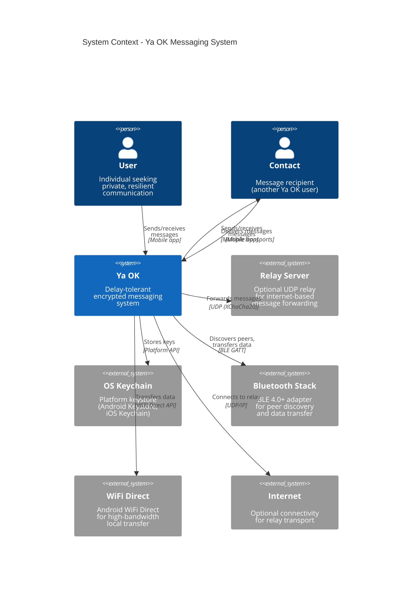
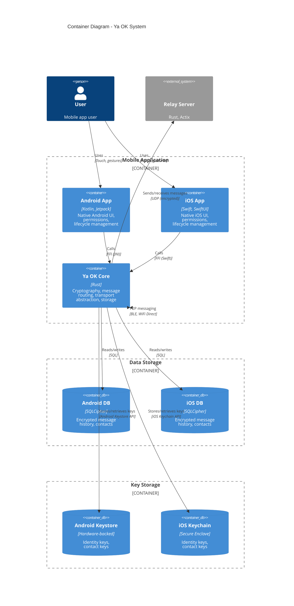
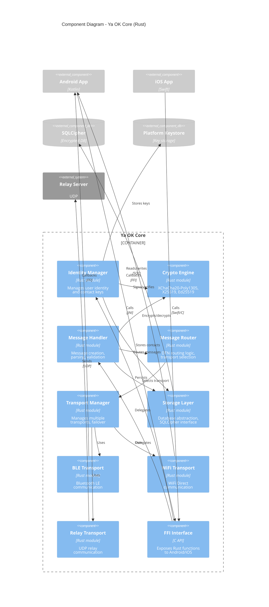
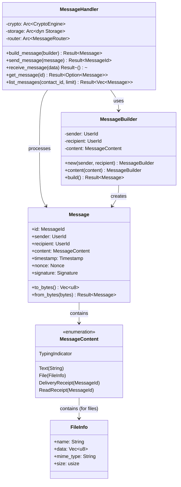
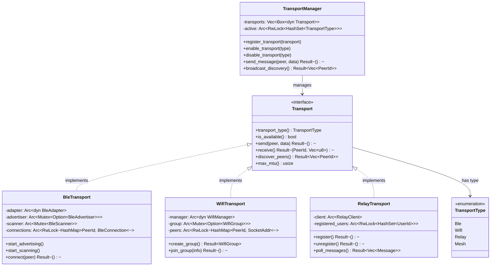
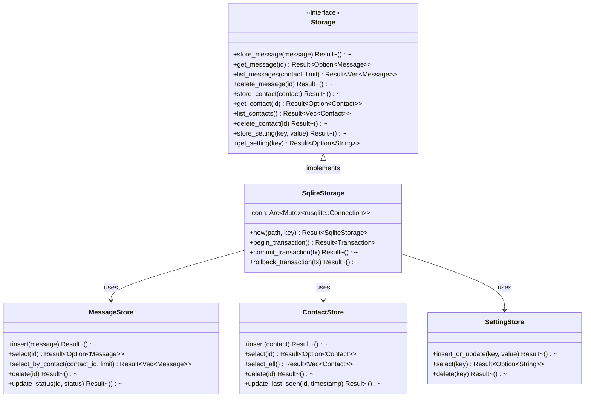
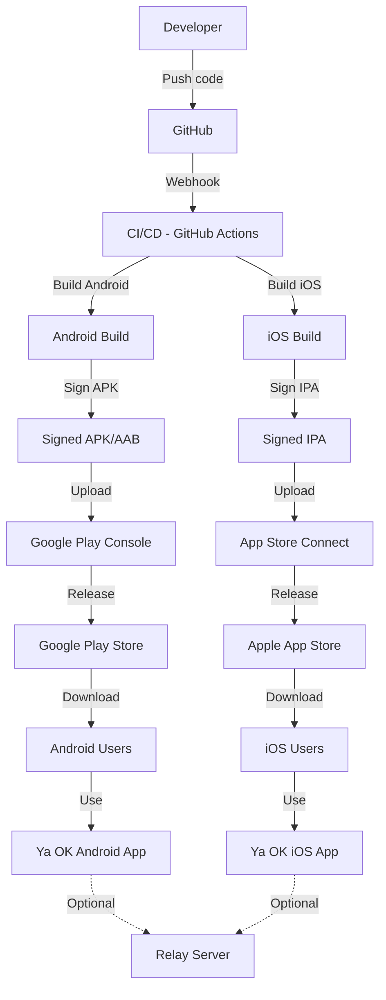
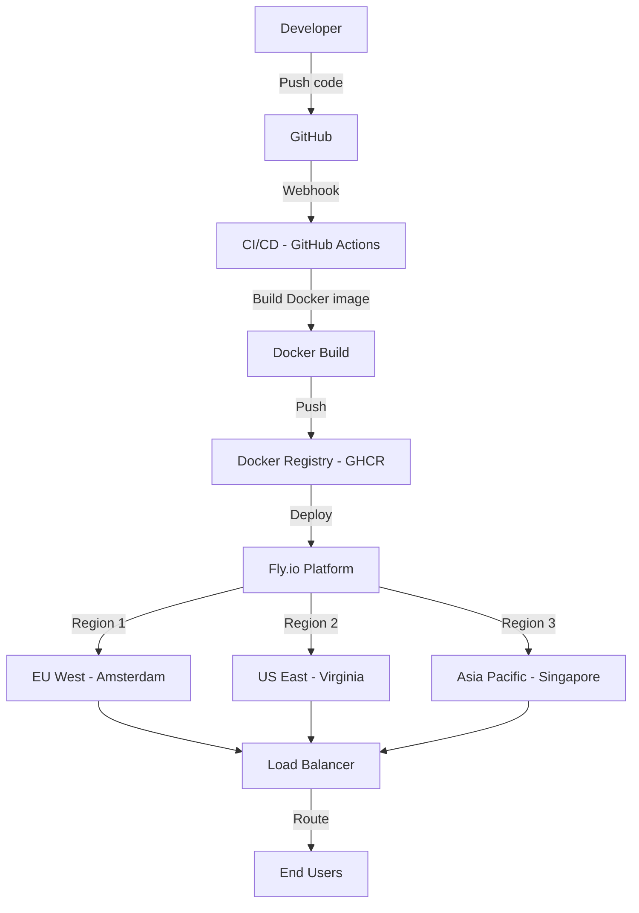
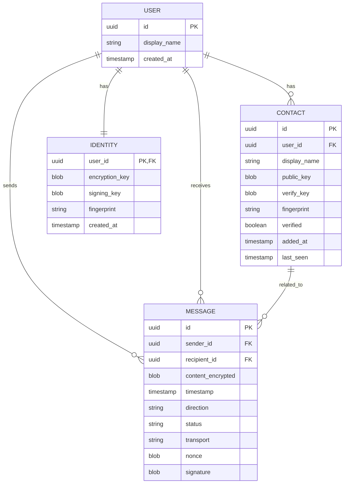

# C4 Architecture Model
## Ya OK - Delay-Tolerant Messaging System

**Document ID:** YA-OK-ARCH-001  
**Version:** 1.0  
**Date:** 2026-02-06  
**Status:** Draft  
**Classification:** INTERNAL

---

## Document Control

| Version | Date | Author | Changes |
|---------|------|--------|---------|
| 1.0 | 2026-02-06 | Architecture Team | Initial version - Complete C4 model |

### Approvals

| Role | Name | Signature | Date |
|------|------|-----------|------|
| Technical Architect | [TBD] | | |
| Security Architect | [TBD] | | |
| Product Owner | [TBD] | | |

### Related Documents

- **YA-OK-SRS-001**: Software Requirements Specification
- **YA-OK-NFR-001**: Non-Functional Requirements
- **YA-OK-SEC-001**: Security Threat Model
- **YA-OK-SEC-002**: Security Requirements Specification
- **YA-OK-ARCH-002**: Sequence Diagrams (companion document)

---

## Table of Contents

1. [Introduction](#1-introduction)
2. [Architecture Principles](#2-architecture-principles)
3. [Level 1: System Context](#3-level-1-system-context)
4. [Level 2: Container](#4-level-2-container)
5. [Level 3: Component](#5-level-3-component)
6. [Level 4: Code](#6-level-4-code)
7. [Deployment Architecture](#7-deployment-architecture)
8. [Data Architecture](#8-data-architecture)
9. [Security Architecture](#9-security-architecture)
10. [Cross-Cutting Concerns](#10-cross-cutting-concerns)
11. [Architecture Decisions](#11-architecture-decisions)
12. [Appendix](#12-appendix)

---

## 1. Introduction

### 1.1 Purpose

This document provides a comprehensive architectural view of the **Ya OK** delay-tolerant messaging system using the C4 model (Context, Container, Component, Code). It serves as the authoritative reference for understanding the system's structure, behavior, and design decisions.

### 1.2 Scope

**Covers:**
- System context and external dependencies
- Container architecture (applications, services, data stores)
- Component architecture (internal structure)
- Code-level design (critical components)
- Deployment and infrastructure
- Security architecture
- Data flows and persistence

**Out of Scope:**
- Detailed protocol specifications (see separate docs)
- Operational procedures (see YA-OK-OPS-001)
- Test plans (see YA-OK-TEST-001)

### 1.3 Audience

- Software architects and developers
- Security engineers
- DevOps and infrastructure teams
- QA engineers
- Technical product managers
- Auditors and compliance officers

### 1.4 Architecture Model

This document follows the **C4 model** created by Simon Brown:

| Level | Description | Audience |
|-------|-------------|----------|
| **Context** | System boundaries, external actors | Everyone |
| **Container** | Applications, data stores, technology choices | Technical stakeholders |
| **Component** | Internal structure of containers | Developers, architects |
| **Code** | Classes, interfaces, design patterns | Developers |

### 1.5 System Overview

**Ya OK** is a privacy-focused, delay-tolerant messaging system designed for hostile environments where traditional internet-based communication is unreliable or compromised. The system operates across multiple transport layers (Bluetooth LE, WiFi Direct, Mesh Networking, UDP Relay) and provides end-to-end encrypted messaging without requiring centralized infrastructure.

**Key Characteristics:**
- **Delay-Tolerant Networking (DTN)**: Messages route opportunistically through available transports
- **E2E Encryption**: XChaCha20-Poly1305 AEAD, X25519 key exchange, Ed25519 signatures
- **Multi-Platform**: Android (API 24+), iOS (14+), with shared Rust core
- **Decentralized**: No mandatory central server (optional relay for internet delivery)
- **Privacy-First**: No metadata collection, no phone numbers, no cloud storage

---

## 2. Architecture Principles

### 2.1 Design Principles

| Principle | Description | Rationale |
|-----------|-------------|-----------|
| **Security by Design** | Cryptography at the core, zero-trust model | User safety in hostile environments |
| **Privacy by Default** | No metadata collection, local-only data | GDPR/CCPA compliance, user trust |
| **Offline-First** | Full functionality without internet | Target use cases (protests, emergencies, rural) |
| **Transport Agnostic** | Abstract transport layer, automatic failover | Resilience, adaptability |
| **Minimal Dependencies** | Self-contained, avoid external services | Reduce attack surface, improve reliability |
| **Cross-Platform** | Shared Rust core, native UIs | Consistency, security, maintainability |
| **Open Source** | Transparent, auditable | Community trust, security validation |

### 2.2 Quality Attributes (ISO 25010)

From **YA-OK-NFR-001**, prioritized by importance:

| Attribute | Priority | Key Requirements |
|-----------|----------|------------------|
| **Security** | P0 | E2E encryption, key management, tamper detection |
| **Reliability** | P0 | 99% uptime, crash-free rate 99%+, message delivery 95%+ |
| **Performance** | P1 | <100ms latency (local), <1s message send, <2s startup |
| **Privacy** | P1 | Zero metadata collection, secure deletion, no telemetry |
| **Usability** | P1 | <5min setup, <30s first message, accessibility WCAG 2.1 AA |
| **Maintainability** | P2 | Modular design, test coverage 80%+, documentation |
| **Portability** | P2 | Android 7.0+, iOS 14+, future web support |
| **Compatibility** | P3 | Bluetooth 4.0+, WiFi Direct, backward compatibility |

### 2.3 Constraints

**Technical:**
- Mobile platforms: Android API 24+ (Nougat), iOS 14+
- Bluetooth: BLE 4.0+ with limited MTU (512 bytes)
- WiFi Direct: Android-only (no iOS support)
- Battery: Minimize background processing
- Memory: Limit message history (10,000 messages default)

**Regulatory:**
- GDPR compliance (EU users)
- CCPA compliance (California users)
- Export controls (cryptography)
- App store policies (Google Play, Apple App Store)

**Operational:**
- No 24/7 support team initially
- Limited infrastructure budget
- Open-source commitment
- Security audit before v1.0

---

## 3. Level 1: System Context

### 3.1 Context Diagram



**Textual Description:**

```
┌─────────────────────────────────────────────────────────────┐
│                    SYSTEM CONTEXT                           │
│                                                             │
│  ┌─────────┐                                  ┌─────────┐  │
│  │  User   │◄────── Mobile App ──────────────►│ Contact │  │
│  │ (Alice) │                                  │  (Bob)  │  │
│  └────┬────┘                                  └────┬────┘  │
│       │                                            │       │
│       │        ┌─────────────────────┐             │       │
│       └───────►│                     │◄────────────┘       │
│                │      Ya OK          │                     │
│                │  Messaging System   │                     │
│                └──────────┬──────────┘                     │
│                           │                                │
│        ┌──────────────────┼──────────────────┐             │
│        │                  │                  │             │
│        ▼                  ▼                  ▼             │
│  ┌──────────┐      ┌──────────┐      ┌──────────┐         │
│  │ Bluetooth│      │   WiFi   │      │  Relay   │         │
│  │   Stack  │      │  Direct  │      │  Server  │         │
│  └──────────┘      └──────────┘      └────┬─────┘         │
│                                            │               │
│                    ┌───────────────────────┘               │
│                    ▼                                       │
│             ┌──────────────┐                               │
│             │   Internet   │                               │
│             └──────────────┘                               │
│                                                             │
│  ┌──────────────────────────────────────────┐              │
│  │   OS Keychain (Android/iOS)              │              │
│  │   - Stores cryptographic keys            │              │
│  │   - Hardware-backed security             │              │
│  └──────────────────────────────────────────┘              │
└─────────────────────────────────────────────────────────────┘
```

### 3.2 External Actors

| Actor | Type | Description | Interactions |
|-------|------|-------------|--------------|
| **User (Alice)** | Person | Primary user of Ya OK app | Sends messages, adds contacts, configures settings |
| **Contact (Bob)** | Person | Message recipient (another Ya OK user) | Receives messages, sends acknowledgments |
| **Relay Server** | System | Optional internet-based message forwarder | Receives encrypted messages, forwards to recipients |
| **OS Keychain** | System | Platform-provided secure key storage | Stores identity keys, contact keys, encryption keys |
| **Bluetooth Stack** | System | OS Bluetooth Low Energy implementation | Peer discovery, GATT communication, data transfer |
| **WiFi Direct** | System | Android WiFi Direct (P2P) stack | Group formation, socket communication, bulk transfer |
| **Internet** | System | Public network infrastructure | UDP communication to relay server |

### 3.3 System Responsibilities

**Ya OK System:**
- Generate and manage cryptographic identities (X25519, Ed25519)
- Encrypt and decrypt messages (XChaCha20-Poly1305)
- Discover nearby peers via Bluetooth/WiFi
- Route messages across multiple transports
- Store messages securely (SQLCipher)
- Verify message authenticity and integrity
- Provide user interface for messaging

**Not Responsible For:**
- Providing centralized infrastructure (optional relay is external)
- Phone number verification or identity validation
- Message backup to cloud
- Metadata collection or analytics
- Content moderation

### 3.4 External Dependencies

| Dependency | Type | Critical? | Failure Impact | Mitigation |
|-----------|------|-----------|---------------|------------|
| **OS Keychain** | Platform | Yes | Cannot store keys securely | Fallback to app-level encryption (less secure) |
| **Bluetooth Stack** | Platform | Yes | Cannot use BLE transport | Fallback to WiFi/Relay |
| **WiFi Direct** | Platform | No | Cannot use WiFi transport | Use BLE/Relay instead |
| **Relay Server** | External | No | Cannot reach internet users | Local transports still work |
| **Internet** | Network | No | Relay unavailable | Fully functional locally |

---

## 4. Level 2: Container

### 4.1 Container Diagram



**Textual Description:**

```
┌──────────────────────────────────────────────────────────────┐
│                   CONTAINER ARCHITECTURE                     │
│                                                              │
│  ┌───────────────────────────────────────────────┐           │
│  │            Mobile Application                 │           │
│  │                                               │           │
│  │  ┌─────────────┐         ┌─────────────┐     │           │
│  │  │ Android App │         │   iOS App   │     │           │
│  │  │  (Kotlin)   │         │   (Swift)   │     │           │
│  │  └──────┬──────┘         └──────┬──────┘     │           │
│  │         │                       │            │           │
│  │         │    FFI (JNI/Swift)    │            │           │
│  │         └───────┬───────────────┘            │           │
│  │                 │                            │           │
│  │         ┌───────▼────────┐                   │           │
│  │         │  Ya OK Core    │                   │           │
│  │         │    (Rust)      │                   │           │
│  │         │                │                   │           │
│  │         │ - Crypto       │                   │           │
│  │         │ - Routing      │                   │           │
│  │         │ - Transports   │                   │           │
│  │         │ - Storage      │                   │           │
│  │         └────┬───┬───┬───┘                   │           │
│  └──────────────┼───┼───┼───────────────────────┘           │
│                 │   │   │                                   │
│     ┌───────────┘   │   └───────────┐                       │
│     │               │               │                       │
│     ▼               ▼               ▼                       │
│  ┌─────────┐  ┌─────────┐  ┌──────────────┐                │
│  │ SQLCipher│  │ Android │  │ iOS Keychain │                │
│  │ Database│  │Keystore │  │ (Sec. Enclave)│                │
│  └─────────┘  └─────────┘  └──────────────┘                │
│                                                              │
│  ┌────────────────────────────────────────┐                 │
│  │         Transport Layers               │                 │
│  │  ┌──────┐  ┌──────┐  ┌──────┐          │                 │
│  │  │ BLE  │  │WiFi  │  │ Relay│          │                 │
│  │  │      │  │Direct│  │(UDP) │          │                 │
│  │  └──────┘  └──────┘  └───┬──┘          │                 │
│  └──────────────────────────┼─────────────┘                 │
│                             │                               │
│                             ▼                               │
│                   ┌─────────────────┐                       │
│                   │  Relay Server   │                       │
│                   │ (Rust + Actix)  │                       │
│                   └─────────────────┘                       │
└──────────────────────────────────────────────────────────────┘
```

### 4.2 Container Descriptions

#### 4.2.1 Android App (Kotlin)

**Technology:** Kotlin, Android SDK, Jetpack Compose  
**Responsibility:** Native Android user interface and platform integration

**Key Functions:**
- UI rendering (Jetpack Compose)
- Permission management (Camera, Bluetooth, Storage)
- Lifecycle management (Activities, Services)
- Notifications (Firebase Cloud Messaging for relay)
- Background tasks (WorkManager)
- FFI bridge to Rust core (JNI)

**External Interfaces:**
- Android Keystore API (key storage)
- Bluetooth LE API (peer discovery)
- WiFi Direct API (P2P networking)
- Camera API (QR code scanning)
- Notification API (message alerts)

**Data Flows:**
- **IN**: User input (touch, keyboard), Bluetooth/WiFi data, notifications
- **OUT**: Screen updates, Bluetooth/WiFi data, system notifications

**Security:**
- No sensitive data in memory longer than needed
- Obfuscation via ProGuard/R8
- Certificate pinning for relay communication
- Secure Activity flags (FLAG_SECURE to prevent screenshots)

#### 4.2.2 iOS App (Swift)

**Technology:** Swift, SwiftUI, Combine  
**Responsibility:** Native iOS user interface and platform integration

**Key Functions:**
- UI rendering (SwiftUI)
- Permission management (Camera, Bluetooth, Notifications)
- Lifecycle management (App lifecycle, background modes)
- Notifications (User Notifications framework)
- Background tasks (Background App Refresh)
- FFI bridge to Rust core (Swift/C interop)

**External Interfaces:**
- iOS Keychain API (key storage, Secure Enclave)
- Core Bluetooth API (BLE communication)
- Camera API (QR code scanning)
- User Notifications API (message alerts)

**Data Flows:**
- **IN**: User input (touch, keyboard), Bluetooth data, notifications
- **OUT**: Screen updates, Bluetooth data, system notifications

**Security:**
- Memory zeroing after use
- Code signing and entitlements
- Certificate pinning for relay communication
- App Transport Security (ATS) enforcement

**Note:** iOS does not support WiFi Direct, so only BLE and Relay transports available.

#### 4.2.3 Ya OK Core (Rust)

**Technology:** Rust 1.75+, no_std compatible (for future embedded)  
**Responsibility:** Core business logic, cryptography, message routing, storage

**Key Modules:**

| Module | Responsibility | Key Types |
|--------|---------------|-----------|
| **crypto** | All cryptographic operations | `KeyPair`, `EncryptedMessage`, `Signature` |
| **identity** | Identity management | `Identity`, `Contact`, `IdentityStore` |
| **messaging** | Message creation, parsing | `Message`, `MessageBuilder`, `MessageParser` |
| **transport** | Abstract transport layer | `Transport`, `TransportManager`, `Packet` |
| **routing** | Message routing logic | `Router`, `RoutingTable`, `Route` |
| **storage** | Database abstraction | `MessageStore`, `ContactStore`, `Database` |
| **ble** | Bluetooth LE transport | `BleTransport`, `BleAdvertiser`, `BleScanner` |
| **wifi** | WiFi Direct transport | `WifiTransport`, `WifiGroup` |
| **relay** | Relay server transport | `RelayTransport`, `RelayClient` |
| **mesh** | Mesh networking (future) | `MeshNode`, `MeshRouter` |

**External Dependencies:**
- **Cryptography**: `chacha20poly1305`, `x25519-dalek`, `ed25519-dalek`, `rand_core`
- **Database**: `rusqlite`, `sqlcipher`
- **Networking**: `tokio` (async runtime), `quinn` (future QUIC support)
- **Serialization**: `serde`, `bincode`
- **FFI**: `cbindgen` (generate C headers)

**Data Flows:**
- **IN**: FFI calls from Android/iOS, transport layer data (BLE, WiFi, UDP)
- **OUT**: FFI callbacks to Android/iOS, transport layer data, database writes

**Security:**
- Memory safety via Rust ownership
- Constant-time cryptographic operations
- Secure random number generation (`OsRng`)
- Key erasure on drop (via `zeroize` crate)
- No heap allocations for secrets when possible

**Performance:**
- Zero-copy message parsing where possible
- Asynchronous I/O (Tokio runtime)
- Connection pooling for relay transport
- Bloom filters for duplicate detection

#### 4.2.4 Relay Server (Rust + Actix)

**Technology:** Rust, Actix-web, Tokio  
**Responsibility:** Optional internet-based message forwarding

**Key Functions:**
- Accept encrypted message blobs from clients
- Forward messages to online recipients
- Queue messages for offline recipients (limited time)
- Rate limiting and abuse prevention
- Health monitoring and metrics

**External Interfaces:**
- UDP socket (port 41641)
- HTTPS API for health checks (port 443)
- Prometheus metrics endpoint

**Data Flows:**
- **IN**: Encrypted message blobs (UDP), health check requests (HTTPS)
- **OUT**: Forwarded message blobs (UDP), metrics (Prometheus)

**Security:**
- No message decryption (end-to-end encrypted)
- No metadata logging (only aggregate statistics)
- Rate limiting per client IP
- DDoS protection (connection limits, packet size limits)
- TLS 1.3 for HTTPS endpoints

**Deployment:**
- Dockerized (Alpine Linux base)
- Deployed on Fly.io (multiple regions)
- Auto-scaling based on load
- Health checks via /health endpoint

**Note:** Relay server is **optional** and **untrusted** - all messages are end-to-end encrypted, relay cannot read content or metadata.

#### 4.2.5 SQLCipher Database

**Technology:** SQLCipher 4.x (AES-256 encrypted SQLite)  
**Responsibility:** Persistent storage of messages, contacts, settings

**Schema:**

```sql
-- Messages table
CREATE TABLE messages (
    id TEXT PRIMARY KEY,                -- Message UUID
    contact_id TEXT NOT NULL,           -- Contact UUID (sender/recipient)
    content BLOB NOT NULL,              -- Encrypted message content
    timestamp INTEGER NOT NULL,         -- Unix timestamp (milliseconds)
    direction TEXT NOT NULL,            -- 'sent' or 'received'
    status TEXT NOT NULL,               -- 'pending', 'sent', 'delivered', 'failed'
    transport TEXT,                     -- 'ble', 'wifi', 'relay', 'mesh'
    nonce BLOB NOT NULL,                -- XChaCha20 nonce (24 bytes)
    signature BLOB NOT NULL,            -- Ed25519 signature (64 bytes)
    FOREIGN KEY (contact_id) REFERENCES contacts(id)
);

-- Contacts table
CREATE TABLE contacts (
    id TEXT PRIMARY KEY,                -- Contact UUID
    display_name TEXT NOT NULL,         -- User-assigned name
    public_key BLOB NOT NULL,           -- X25519 public key (32 bytes)
    signing_key BLOB NOT NULL,          -- Ed25519 public key (32 bytes)
    added_at INTEGER NOT NULL,          -- Unix timestamp
    last_seen INTEGER,                  -- Last peer discovery
    verified INTEGER DEFAULT 0,         -- Safety number verified?
    fingerprint TEXT NOT NULL           -- Key fingerprint (hex)
);

-- Settings table
CREATE TABLE settings (
    key TEXT PRIMARY KEY,               -- Setting name
    value TEXT NOT NULL                 -- Setting value (JSON)
);

-- Routing table (DTN)
CREATE TABLE routing (
    destination TEXT NOT NULL,          -- Destination contact ID
    next_hop TEXT NOT NULL,             -- Next hop contact ID
    cost INTEGER NOT NULL,              -- Route cost (hop count)
    updated_at INTEGER NOT NULL,        -- Last update timestamp
    PRIMARY KEY (destination, next_hop)
);
```

**Encryption:**
- Database file encrypted with AES-256
- Key derived from device-specific secret (Android Keystore / iOS Keychain)
- PBKDF2 key derivation (iterations: 64,000)

**Data Retention:**
- Messages: Configurable (default 30 days, max 10,000 messages)
- Contacts: No automatic deletion
- Routing: Stale entries removed after 24 hours

**Security:**
- WAL mode disabled (to prevent unencrypted journal files)
- Secure deletion enabled (`PRAGMA secure_delete = ON`)
- Memory security (`PRAGMA cipher_memory_security = ON`)

#### 4.2.6 Platform Key Storage

**Android Keystore:**
- Hardware-backed (Trusted Execution Environment or Secure Element)
- Keys never leave secure hardware
- Biometric authentication integration
- API Level 24+ (Android 7.0+)

**iOS Keychain:**
- Secure Enclave integration (A7+ chips)
- Hardware-backed key generation and storage
- Touch ID / Face ID authentication
- Protected by device passcode

**Stored Keys:**
- **Identity Key Pair**: X25519 (encryption), Ed25519 (signing)
- **Database Key**: AES-256 key for SQLCipher
- **Relay Authentication Token**: Optional, for relay server

**Key Lifecycle:**
- Generated on first launch (identity key)
- Never exported or backed up
- Deleted on app uninstall (platform policy)
- Can be regenerated (creates new identity)

---

## 5. Level 3: Component

### 5.1 Ya OK Core Components



**Textual Description:**

```
┌──────────────────────────────────────────────────────────────┐
│                  Ya OK Core (Rust)                           │
│                                                              │
│  ┌──────────────┐                        ┌──────────────┐   │
│  │     FFI      │◄───────────────────────│ Android/iOS  │   │
│  │  Interface   │                        │     Apps     │   │
│  └──────┬───────┘                        └──────────────┘   │
│         │                                                   │
│         ├─────────────────┬─────────────────┐               │
│         │                 │                 │               │
│         ▼                 ▼                 ▼               │
│  ┌──────────────┐  ┌──────────────┐  ┌──────────────┐      │
│  │  Identity    │  │   Message    │  │   Storage    │      │
│  │   Manager    │  │   Handler    │  │    Layer     │      │
│  └──────┬───────┘  └──────┬───────┘  └──────┬───────┘      │
│         │                 │                 │               │
│         │       ┌─────────┴─────────┐       │               │
│         │       │                   │       │               │
│         ▼       ▼                   ▼       ▼               │
│  ┌──────────────────────┐    ┌──────────────────┐           │
│  │   Crypto Engine      │    │   Message Router │           │
│  │  - XChaCha20-Poly1305│    │   - DTN logic    │           │
│  │  - X25519 (ECDH)     │    │   - Route table  │           │
│  │  - Ed25519 (sign)    │    └────────┬─────────┘           │
│  └──────────────────────┘             │                     │
│                                        ▼                     │
│                            ┌────────────────────┐            │
│                            │ Transport Manager  │            │
│                            └────┬───┬───┬───────┘            │
│                                 │   │   │                    │
│                ┌────────────────┘   │   └────────────────┐   │
│                │                    │                    │   │
│                ▼                    ▼                    ▼   │
│         ┌───────────┐        ┌───────────┐       ┌──────────┐│
│         │    BLE    │        │   WiFi    │       │  Relay   ││
│         │ Transport │        │ Transport │       │Transport ││
│         └─────┬─────┘        └─────┬─────┘       └────┬─────┘│
│               │                    │                  │      │
│               └────────────────────┴──────────────────┘      │
│                               │                              │
└───────────────────────────────┼──────────────────────────────┘
                                │
                    ┌───────────┴───────────┐
                    │                       │
                    ▼                       ▼
            ┌──────────────┐       ┌──────────────┐
            │  SQLCipher   │       │Platform Keys │
            │   Database   │       │   (Keystore) │
            └──────────────┘       └──────────────┘
```

### 5.2 Component Descriptions

#### 5.2.1 Identity Manager

**Responsibility:** Manage user identity, contact keys, and authentication.

**Key Types:**
```rust
pub struct IdentityManager {
    identity: Arc<RwLock<Identity>>,
    contacts: Arc<RwLock<HashMap<ContactId, Contact>>>,
    keystore: Box<dyn KeyStore>,
    storage: Arc<dyn Storage>,
}

pub struct Identity {
    id: UserId,
    display_name: String,
    key_pair: KeyPair,          // X25519 encryption key
    signing_key: SigningKey,     // Ed25519 signing key
    created_at: Timestamp,
}

pub struct Contact {
    id: ContactId,
    display_name: String,
    public_key: PublicKey,       // X25519
    verify_key: VerifyKey,       // Ed25519
    fingerprint: Fingerprint,
    verified: bool,
    added_at: Timestamp,
    last_seen: Option<Timestamp>,
}
```

**Key Operations:**
- `generate_identity()` - Create new identity on first launch
- `export_identity()` - Export public identity (QR code)
- `import_contact()` - Add contact from QR code
- `verify_contact()` - Verify safety number
- `get_identity()` - Retrieve own identity
- `get_contact()` - Retrieve contact by ID
- `list_contacts()` - List all contacts

**Security:**
- Private keys never leave keystore
- All operations require authentication (PIN/biometric)
- Contact verification via safety numbers (BLAKE3 hash of combined public keys)

#### 5.2.2 Crypto Engine

**Responsibility:** All cryptographic operations (encryption, decryption, signing, verification, key exchange).

**Key Types:**
```rust
pub struct CryptoEngine {
    rng: OsRng,
}

pub struct EncryptedMessage {
    nonce: Nonce,                // 24 bytes (XChaCha20)
    ciphertext: Vec<u8>,         // Encrypted payload
    tag: Tag,                    // 16 bytes (Poly1305 MAC)
}

pub struct KeyPair {
    secret: SecretKey,           // 32 bytes (X25519)
    public: PublicKey,           // 32 bytes (X25519)
}

pub struct SigningKey {
    secret: ed25519_dalek::SecretKey,  // 32 bytes
    public: ed25519_dalek::PublicKey,  // 32 bytes
}
```

**Key Operations:**
- `generate_keypair()` - Generate X25519 key pair
- `generate_signing_key()` - Generate Ed25519 signing key
- `encrypt()` - Encrypt message (XChaCha20-Poly1305 AEAD)
- `decrypt()` - Decrypt and verify message
- `sign()` - Sign message (Ed25519)
- `verify()` - Verify signature
- `key_exchange()` - Perform ECDH key exchange (X25519)
- `derive_key()` - Derive shared secret (HKDF-SHA256)

**Algorithms:**
- **Encryption**: XChaCha20-Poly1305 (AEAD)
- **Key Exchange**: X25519 (Curve25519 ECDH)
- **Signatures**: Ed25519 (EdDSA)
- **Hashing**: BLAKE3, SHA-256
- **KDF**: HKDF-SHA256
- **RNG**: OsRng (CSPRNG)

**Security:**
- Constant-time operations (side-channel resistant)
- Memory zeroing via `zeroize` crate
- No key material in error messages or logs
- Forward secrecy via ephemeral keys (future improvement)

#### 5.2.3 Message Handler

**Responsibility:** Create, parse, validate, and process messages.

**Key Types:**
```rust
pub struct MessageHandler {
    crypto: Arc<CryptoEngine>,
    storage: Arc<dyn Storage>,
    router: Arc<MessageRouter>,
}

pub struct Message {
    id: MessageId,               // UUID v4
    sender: UserId,
    recipient: UserId,
    content: MessageContent,
    timestamp: Timestamp,
    nonce: Nonce,
    signature: Signature,
}

pub enum MessageContent {
    Text(String),
    File { name: String, data: Vec<u8>, mime_type: String },
    DeliveryReceipt(MessageId),
    ReadReceipt(MessageId),
    TypingIndicator,
}

pub struct MessageBuilder {
    sender: UserId,
    recipient: UserId,
    content: MessageContent,
}
```

**Key Operations:**
- `build_message()` - Create new outgoing message
- `parse_message()` - Parse incoming message blob
- `validate_message()` - Verify signature and integrity
- `encrypt_message()` - Encrypt message for recipient
- `decrypt_message()` - Decrypt received message
- `send_message()` - Hand off to router for transmission
- `receive_message()` - Process incoming message
- `generate_receipt()` - Create delivery/read receipt

**Message Format (Binary):**
```
┌─────────────────────────────────────────────────────┐
│ Version (1 byte)                                    │
├─────────────────────────────────────────────────────┤
│ Message Type (1 byte): 0x01=Text, 0x02=File, etc.  │
├─────────────────────────────────────────────────────┤
│ Sender ID (16 bytes, UUID)                          │
├─────────────────────────────────────────────────────┤
│ Recipient ID (16 bytes, UUID)                       │
├─────────────────────────────────────────────────────┤
│ Timestamp (8 bytes, Unix millis)                    │
├─────────────────────────────────────────────────────┤
│ Nonce (24 bytes, XChaCha20)                         │
├─────────────────────────────────────────────────────┤
│ Ciphertext Length (4 bytes, u32 little-endian)     │
├─────────────────────────────────────────────────────┤
│ Ciphertext (variable length)                        │
├─────────────────────────────────────────────────────┤
│ Signature (64 bytes, Ed25519)                       │
└─────────────────────────────────────────────────────┘
Total: 134 + ciphertext_len bytes
```

#### 5.2.4 Message Router

**Responsibility:** Implement DTN routing logic, select optimal transport, manage routing table.

**Key Types:**
```rust
pub struct MessageRouter {
    routing_table: Arc<RwLock<RoutingTable>>,
    transport_mgr: Arc<TransportManager>,
}

pub struct RoutingTable {
    routes: HashMap<ContactId, Vec<Route>>,
    updated_at: HashMap<ContactId, Timestamp>,
}

pub struct Route {
    destination: ContactId,
    next_hop: Option<ContactId>,  // None = direct
    transport: TransportType,
    cost: u32,                    // Hop count
    last_success: Option<Timestamp>,
}

pub enum TransportType {
    Ble,
    Wifi,
    Relay,
    Mesh,
}
```

**Key Operations:**
- `route_message()` - Select best route for message
- `update_route()` - Update routing table from discovery
- `select_transport()` - Choose transport based on availability and cost
- `handle_delivery_failure()` - Fallback to alternate routes
- `discover_routes()` - Beacon/probe for new routes
- `prune_stale_routes()` - Remove outdated routing entries

**Routing Strategy:**
1. **Direct Route**: If recipient is directly reachable (BLE/WiFi), send directly
2. **Relay Route**: If relay server is available and recipient is registered, use relay
3. **Multi-Hop Route**: Store-and-forward through intermediate peers (future mesh)
4. **Store-and-Forward**: Store message locally if no route available, retry later

**DTN Optimizations:**
- **Epidemic Routing**: Opportunistic flooding for high delivery probability
- **Spray-and-Wait**: Limited replication (k copies) to reduce overhead
- **PRoPHET**: Probabilistic routing based on encounter history

#### 5.2.5 Transport Manager

**Responsibility:** Manage multiple transports, coordinate failover, provide unified interface.

**Key Types:**
```rust
pub struct TransportManager {
    transports: Vec<Box<dyn Transport>>,
    active: Arc<RwLock<HashSet<TransportType>>>,
}

#[async_trait]
pub trait Transport: Send + Sync {
    fn transport_type(&self) -> TransportType;
    fn is_available(&self) -> bool;
    async fn send(&self, peer: PeerId, data: &[u8]) -> Result<()>;
    async fn receive(&self) -> Result<(PeerId, Vec<u8>)>;
    async fn discover_peers(&self) -> Result<Vec<PeerId>>;
    fn max_mtu(&self) -> usize;
}
```

**Key Operations:**
- `register_transport()` - Add transport to manager
- `enable_transport()` - Enable specific transport
- `disable_transport()` - Disable specific transport
- `send_message()` - Send via appropriate transport
- `broadcast_discovery()` - Discover peers on all active transports
- `get_available_transports()` - List currently available transports

**Transport Priority (Default):**
1. **WiFi Direct** (fastest, highest bandwidth, but Android-only)
2. **Bluetooth LE** (universal, low power, but limited MTU)
3. **Relay** (internet-based, works globally, but requires connectivity)
4. **Mesh** (future, multi-hop, resilient)

**Failover Logic:**
```
1. Attempt primary transport (WiFi if available, else BLE)
2. If send fails, try secondary transport (BLE → Relay)
3. If all direct transports fail, queue for relay
4. If relay unavailable, store locally and retry periodically
5. After 24 hours, mark message as failed
```

#### 5.2.6 BLE Transport

**Responsibility:** Implement Bluetooth LE communication (GATT, advertising, scanning).

**Key Types:**
```rust
pub struct BleTransport {
    adapter: Arc<dyn BleAdapter>,
    advertiser: Arc<Mutex<Option<BleAdvertiser>>>,
    scanner: Arc<Mutex<BleScanner>>,
    connections: Arc<RwLock<HashMap<PeerId, BleConnection>>>,
}

pub struct BleAdvertiser {
    service_uuid: Uuid,          // Ya OK service UUID
    characteristics: Vec<Characteristic>,
}

pub struct BleScanner {
    service_uuid: Uuid,
    discovered: Vec<PeerId>,
}
```

**GATT Service Definition:**
```
Service UUID: 0000yaok-0000-1000-8000-00805f9b34fb

Characteristics:
  - Identity (Read): Public key + signing key (64 bytes)
  - Message RX (Write): Incoming message chunks (512 bytes max)
  - Message TX (Read/Notify): Outgoing message chunks
  - Control (Read/Write): Control commands (1 byte)
```

**Key Operations:**
- `start_advertising()` - Advertise Ya OK service
- `start_scanning()` - Scan for Ya OK peers
- `connect()` - Establish GATT connection
- `send_message()` - Send message via GATT write
- `receive_message()` - Receive message via GATT read/notify
- `disconnect()` - Close GATT connection

**Chunking (BLE MTU Limitation):**
```
Message > 512 bytes → Split into chunks
Chunk Format:
  - Chunk ID (2 bytes): Sequence number
  - Total Chunks (2 bytes): Total number of chunks
  - Data (508 bytes): Chunk payload

Reassembly:
  1. Collect all chunks
  2. Sort by Chunk ID
  3. Concatenate payloads
  4. Verify total length matches
```

**Performance:**
- MTU: 512 bytes (negotiated, default 23 bytes)
- Throughput: ~50 KB/s (depends on device and distance)
- Discovery time: 2-5 seconds
- Connection establishment: 1-2 seconds

#### 5.2.7 WiFi Direct Transport

**Responsibility:** Implement WiFi Direct (P2P) communication for high-bandwidth local transfer.

**Key Types:**
```rust
pub struct WifiTransport {
    manager: Arc<dyn WifiManager>,
    group: Arc<Mutex<Option<WifiGroup>>>,
    peers: Arc<RwLock<HashMap<PeerId, SocketAddr>>>,
}

pub struct WifiGroup {
    is_owner: bool,
    owner_addr: IpAddr,
    ssid: String,
    passphrase: String,
}
```

**Key Operations:**
- `create_group()` - Create WiFi Direct group (group owner)
- `join_group()` - Join existing group (client)
- `discover_peers()` - Discover WiFi Direct peers
- `connect()` - Establish TCP socket connection
- `send_message()` - Send message via TCP socket
- `receive_message()` - Receive message via TCP socket

**WiFi Direct Flow:**
```
1. Peer A creates group (becomes group owner)
2. Peer A advertises via BLE (includes SSID, passphrase)
3. Peer B discovers Peer A via BLE
4. Peer B joins WiFi Direct group
5. Peer B connects to Peer A via TCP socket
6. Bidirectional message transfer over TCP
7. When done, Peer B disconnects and leaves group
```

**Performance:**
- Throughput: ~5-10 MB/s
- Discovery: Piggyback on BLE discovery
- Connection establishment: 5-10 seconds
- Range: ~100 meters (same as WiFi)

**Limitations:**
- **Android-only** (iOS does not support WiFi Direct API)
- Slower connection establishment than BLE
- Interrupts normal WiFi connectivity while active

#### 5.2.8 Relay Transport

**Responsibility:** Implement UDP-based relay communication for internet-based message delivery.

**Key Types:**
```rust
pub struct RelayTransport {
    client: Arc<RelayClient>,
    registered_users: Arc<RwLock<HashSet<UserId>>>,
}

pub struct RelayClient {
    relay_url: Url,
    socket: UdpSocket,
    auth_token: Option<String>,
}

pub struct RelayPacket {
    version: u8,
    packet_type: PacketType,
    sender: UserId,
    recipient: UserId,
    payload: Vec<u8>,
}

pub enum PacketType {
    Register,
    Unregister,
    Message,
    Ack,
    Ping,
    Pong,
}
```

**Key Operations:**
- `register()` - Register with relay server
- `unregister()` - Unregister from relay
- `send_message()` - Send message via relay
- `poll_messages()` - Poll for incoming messages
- `send_ack()` - Acknowledge message receipt

**Relay Protocol (UDP):**
```
Packet Format:
┌─────────────────────────────────────────┐
│ Magic Bytes (4 bytes): 0x59414F4B      │  "YAOK"
├─────────────────────────────────────────┤
│ Version (1 byte): 0x01                  │
├─────────────────────────────────────────┤
│ Packet Type (1 byte)                    │
├─────────────────────────────────────────┤
│ Sender ID (16 bytes, UUID)              │
├─────────────────────────────────────────┤
│ Recipient ID (16 bytes, UUID)           │
├─────────────────────────────────────────┤
│ Payload Length (4 bytes, u32)           │
├─────────────────────────────────────────┤
│ Payload (variable, encrypted message)   │
└─────────────────────────────────────────┘
```

**Relay Server Behavior:**
- **Register**: Client registers UUID, relay stores IP:Port mapping
- **Message**: Relay forwards encrypted blob to recipient (if online) or queues (if offline)
- **Queue**: Messages queued for max 7 days, then deleted
- **Ack**: Recipient acknowledges delivery, relay deletes from queue

**Security:**
- All messages are end-to-end encrypted (relay cannot read)
- Relay sees: sender UUID, recipient UUID, timestamp, IP addresses
- No authentication required (abuse mitigation via rate limiting)
- Optional authentication token for prioritized delivery (future)

**Performance:**
- Latency: Depends on internet connection and relay proximity
- Throughput: Limited by upload bandwidth and relay capacity
- Reliability: Depends on internet connectivity

#### 5.2.9 Storage Layer

**Responsibility:** Abstract database operations, provide type-safe interface.

**Key Types:**
```rust
#[async_trait]
pub trait Storage: Send + Sync {
    async fn store_message(&self, msg: &Message) -> Result<()>;
    async fn get_message(&self, id: MessageId) -> Result<Option<Message>>;
    async fn list_messages(&self, contact: ContactId, limit: usize) -> Result<Vec<Message>>;
    async fn delete_message(&self, id: MessageId) -> Result<()>;
    
    async fn store_contact(&self, contact: &Contact) -> Result<()>;
    async fn get_contact(&self, id: ContactId) -> Result<Option<Contact>>;
    async fn list_contacts(&self) -> Result<Vec<Contact>>;
    async fn delete_contact(&self, id: ContactId) -> Result<()>;
    
    async fn store_setting(&self, key: &str, value: &str) -> Result<()>;
    async fn get_setting(&self, key: &str) -> Result<Option<String>>;
}

pub struct SqliteStorage {
    conn: Arc<Mutex<rusqlite::Connection>>,
}
```

**Key Operations:**
- Message CRUD (Create, Read, Update, Delete)
- Contact CRUD
- Settings CRUD
- Transaction support
- Schema migrations

**Database Initialization:**
```rust
pub async fn initialize_database(path: &Path, key: &[u8]) -> Result<SqliteStorage> {
    let conn = rusqlite::Connection::open(path)?;
    
    // Set encryption key
    conn.execute("PRAGMA key = ?", [key])?;
    
    // Security settings
    conn.execute("PRAGMA cipher_memory_security = ON", [])?;
    conn.execute("PRAGMA secure_delete = ON", [])?;
    
    // Performance settings
    conn.execute("PRAGMA journal_mode = DELETE", [])?;  // No WAL for security
    conn.execute("PRAGMA synchronous = FULL", [])?;     // Full disk sync
    
    // Create schema
    run_migrations(&conn)?;
    
    Ok(SqliteStorage { conn: Arc::new(Mutex::new(conn)) })
}
```

#### 5.2.10 FFI Interface

**Responsibility:** Expose Rust functions to Android (JNI) and iOS (Swift/C).

**C API (Generated by cbindgen):**
```c
// Identity management
extern "C" YaOkResult yaok_generate_identity(const char* display_name);
extern "C" YaOkResult yaok_export_identity(char* out_qr_data, size_t len);
extern "C" YaOkResult yaok_import_contact(const char* qr_data, char* out_contact_id);

// Messaging
extern "C" YaOkResult yaok_send_message(
    const char* contact_id,
    const char* text,
    MessageCallback callback
);
extern "C" YaOkResult yaok_receive_message(const uint8_t* data, size_t len);

// Transport management
extern "C" YaOkResult yaok_enable_transport(TransportType transport);
extern "C" YaOkResult yaok_disable_transport(TransportType transport);
extern "C" YaOkResult yaok_discover_peers(PeerCallback callback);

// Callbacks
typedef void (*MessageCallback)(const char* message_id, MessageStatus status);
typedef void (*PeerCallback)(const char* peer_id, const char* display_name);
```

**Rust Implementation:**
```rust
#[no_mangle]
pub extern "C" fn yaok_send_message(
    contact_id: *const c_char,
    text: *const c_char,
    callback: MessageCallback,
) -> YaOkResult {
    // 1. Convert C strings to Rust
    // 2. Validate inputs
    // 3. Call core function
    // 4. Handle errors
    // 5. Invoke callback asynchronously
    // 6. Return result code
}
```

**Error Handling:**
- C functions return `YaOkResult` enum (success, error codes)
- Detailed errors logged but not exposed to FFI (security)
- Callbacks for asynchronous results

**Memory Management:**
- Rust allocates, Android/iOS frees (via provided free functions)
- Ownership transferred at FFI boundary
- No shared mutable state across FFI

---

## 6. Level 4: Code

### 6.1 Critical Components (Class Diagrams)

#### 6.1.1 Crypto Engine Classes

```mermaid
classDiagram
    class CryptoEngine {
        -rng: OsRng
        +generate_keypair() KeyPair
        +generate_signing_key() SigningKey
        +encrypt(plaintext, recipient_pk) EncryptedMessage
        +decrypt(encrypted, sender_pk) Result~Vec~u8~~
        +sign(data, signing_key) Signature
        +verify(data, signature, verify_key) Result~()~
        +key_exchange(secret, public) SharedSecret
        +derive_key(shared_secret, info) Key
    }
    
    class KeyPair {
        -secret: SecretKey
        +public: PublicKey
        +from_bytes(bytes) Result~KeyPair~
        +to_bytes() [u8; 32]
    }
    
    class SigningKey {
        -secret: ed25519_dalek::SecretKey
        +public: ed25519_dalek::PublicKey
        +sign(message) Signature
    }
    
    class EncryptedMessage {
        +nonce: Nonce
        +ciphertext: Vec~u8~
        +tag: Tag
        +to_bytes() Vec~u8~
        +from_bytes(bytes) Result~EncryptedMessage~
    }
    
    class Nonce {
        +bytes: [u8; 24]
        +generate() Nonce
    }
    
    CryptoEngine --> KeyPair : generates
    CryptoEngine --> SigningKey : generates
    CryptoEngine --> EncryptedMessage : produces
    EncryptedMessage --> Nonce : contains
    KeyPair --> SecretKey : contains
    SigningKey --> ed25519_dalek::SecretKey : contains
```

#### 6.1.2 Message Handler Classes



#### 6.1.3 Transport Classes



#### 6.1.4 Storage Classes



### 6.2 Design Patterns

| Pattern | Component | Purpose |
|---------|-----------|---------|
| **Singleton** | `CryptoEngine`, `TransportManager` | Single instance per application |
| **Factory** | `MessageBuilder`, `KeyPair::generate()` | Encapsulate object creation |
| **Strategy** | `Transport` trait | Interchangeable transport implementations |
| **Observer** | FFI callbacks | Notify UI of state changes |
| **Repository** | `Storage` trait | Abstract data persistence |
| **Builder** | `MessageBuilder` | Construct complex messages |
| **Adapter** | FFI interface | Bridge Rust ↔ Android/iOS |
| **Facade** | `MessageHandler` | Simplify complex subsystem |

### 6.3 Error Handling

**Rust Error Types:**
```rust
#[derive(Debug, thiserror::Error)]
pub enum YaOkError {
    #[error("Cryptographic error: {0}")]
    Crypto(String),
    
    #[error("Storage error: {0}")]
    Storage(#[from] rusqlite::Error),
    
    #[error("Transport error: {0}")]
    Transport(String),
    
    #[error("Invalid message: {0}")]
    InvalidMessage(String),
    
    #[error("Contact not found: {0}")]
    ContactNotFound(ContactId),
    
    #[error("FFI error: {0}")]
    Ffi(String),
}

pub type Result<T> = std::result::Result<T, YaOkError>;
```

**Error Propagation:**
- Rust: `?` operator for automatic error propagation
- FFI: Convert to error codes, log details internally
- UI: Display user-friendly messages (never expose internals)

---

## 7. Deployment Architecture

### 7.1 Mobile App Deployment



**Deployment Environments:**

| Environment | Purpose | Update Frequency |
|-------------|---------|------------------|
| **Development** | Active development, unstable | Continuous |
| **Staging** | Pre-production testing | Weekly |
| **Production** | Public release | Monthly (planned) |

**Build Pipeline (GitHub Actions):**
```yaml
# .github/workflows/android.yml
name: Android Build
on: [push, pull_request]

jobs:
  build:
    runs-on: ubuntu-latest
    steps:
      - uses: actions/checkout@v3
      - name: Setup Rust
        uses: actions-rs/toolchain@v1
        with:
          toolchain: stable
          target: aarch64-linux-android
      - name: Build Rust core
        run: cargo build --release --target aarch64-linux-android
      - name: Setup JDK
        uses: actions/setup-java@v3
        with:
          java-version: '17'
      - name: Build Android AAB
        run: ./gradlew bundleRelease
      - name: Sign AAB
        run: jarsigner -keystore $KEYSTORE app-release.aab
      - name: Upload to Google Play
        uses: r0adkll/upload-google-play@v1
```

### 7.2 Relay Server Deployment



**Infrastructure:**
- **Platform**: Fly.io (serverless, edge deployment)
- **Regions**: 3+ (Amsterdam, Virginia, Singapore)
- **Scaling**: Auto-scale based on CPU/memory usage
- **Redundancy**: Multi-region deployment, automatic failover

**Dockerfile:**
```dockerfile
# relay/Dockerfile
FROM rust:1.75-alpine AS builder
WORKDIR /app
COPY Cargo.toml Cargo.lock ./
COPY src ./src
RUN cargo build --release

FROM alpine:latest
RUN apk add --no-cache ca-certificates
COPY --from=builder /app/target/release/yaok_relay /usr/local/bin/
EXPOSE 41641/udp
EXPOSE 443/tcp
CMD ["yaok_relay"]
```

**Fly.io Configuration:**
```toml
# relay/fly.toml
app = "yaok-relay"

[build]
  dockerfile = "Dockerfile"

[[services]]
  internal_port = 41641
  protocol = "udp"

  [[services.ports]]
    port = 41641

[[services]]
  internal_port = 443
  protocol = "tcp"

  [[services.ports]]
    port = 443

[metrics]
  port = 9091
  path = "/metrics"

[checks]
  [checks.health]
    port = 443
    type = "http"
    interval = "30s"
    timeout = "5s"
    path = "/health"
```

### 7.3 Deployment Diagram

```
┌─────────────────────────────────────────────────────────────┐
│                    DEPLOYMENT ARCHITECTURE                  │
│                                                             │
│  ┌─────────────────────┐      ┌─────────────────────┐      │
│  │   Android Devices   │      │     iOS Devices     │      │
│  │                     │      │                     │      │
│  │  ┌──────────────┐   │      │  ┌──────────────┐   │      │
│  │  │ Ya OK App    │   │      │  │ Ya OK App    │   │      │
│  │  │ (APK/AAB)    │   │      │  │ (IPA)        │   │      │
│  │  └───────┬──────┘   │      │  └───────┬──────┘   │      │
│  └──────────┼──────────┘      └──────────┼──────────┘      │
│             │                            │                 │
│             │     ┌──────────────────┐   │                 │
│             └─────► Bluetooth LE     ◄───┘                 │
│             │     │ WiFi Direct      │   │                 │
│             │     └──────────────────┘   │                 │
│             │                            │                 │
│             │                            │                 │
│             └────────────┬───────────────┘                 │
│                          │                                 │
│                          │ UDP (encrypted)                 │
│                          │                                 │
│                          ▼                                 │
│              ┌───────────────────────┐                     │
│              │   Relay Servers       │                     │
│              │   (Fly.io - Global)   │                     │
│              │                       │                     │
│              │  ┌────────────────┐   │                     │
│              │  │ EU West (AMS)  │   │                     │
│              │  └────────────────┘   │                     │
│              │  ┌────────────────┐   │                     │
│              │  │ US East (VA)   │   │                     │
│              │  └────────────────┘   │                     │
│              │  ┌────────────────┐   │                     │
│              │  │ Asia Pacific   │   │                     │
│              │  │ (Singapore)    │   │                     │
│              │  └────────────────┘   │                     │
│              └───────────────────────┘                     │
│                                                             │
│  ┌──────────────────────────────────────────────┐          │
│  │         External Dependencies                │          │
│  │                                              │          │
│  │  - Google Play Store (Android distribution) │          │
│  │  - Apple App Store (iOS distribution)       │          │
│  │  - Android Keystore (key storage)           │          │
│  │  - iOS Keychain (key storage)               │          │
│  │  - Firebase (optional, notifications)       │          │
│  └──────────────────────────────────────────────┘          │
└─────────────────────────────────────────────────────────────┘
```

---

## 8. Data Architecture

### 8.1 Data Model (ER Diagram)



### 8.2 Data Flows

#### 8.2.1 Message Send Flow

```
User → UI → FFI → MessageHandler → CryptoEngine (encrypt) →
MessageRouter → TransportManager → [BLE/WiFi/Relay] →
Peer Device → TransportManager → MessageHandler →
CryptoEngine (decrypt) → Storage → UI → User
```

#### 8.2.2 Key Exchange Flow

```
User A → Generate QR Code (public keys) → Display
User B → Scan QR Code → Parse keys → Verify fingerprint →
Store in ContactStore → Ready to exchange messages
```

### 8.3 Data Retention

| Data Type | Retention Period | Deletion Method |
|-----------|-----------------|-----------------|
| **Messages** | 30 days default (configurable) | Secure delete (overwrite) |
| **Contacts** | Until manually deleted | Secure delete |
| **Routing Table** | 24 hours (stale entries) | Automatic pruning |
| **Logs** | Never stored | N/A |
| **Crash Reports** | Never sent | N/A |

---

## 9. Security Architecture

### 9.1 Security Layers

```
┌─────────────────────────────────────────────────────────┐
│                    APPLICATION LAYER                    │
│  - PIN/Biometric authentication                         │
│  - Screen security (prevent screenshots)                │
│  - Secure clipboard (auto-clear)                        │
└────────────────────┬────────────────────────────────────┘
                     │
┌────────────────────▼────────────────────────────────────┐
│                   CRYPTOGRAPHIC LAYER                   │
│  - XChaCha20-Poly1305 AEAD encryption                   │
│  - X25519 key exchange                                  │
│  - Ed25519 signatures                                   │
│  - BLAKE3 / SHA-256 hashing                             │
└────────────────────┬────────────────────────────────────┘
                     │
┌────────────────────▼────────────────────────────────────┐
│                    STORAGE LAYER                        │
│  - SQLCipher (AES-256 encrypted database)              │
│  - Secure key storage (Keystore/Keychain)              │
│  - Secure deletion                                      │
└────────────────────┬────────────────────────────────────┘
                     │
┌────────────────────▼────────────────────────────────────┐
│                   TRANSPORT LAYER                       │
│  - BLE GATT (opportunistic encryption)                 │
│  - WiFi Direct (WPA2)                                   │
│  - Relay (TLS 1.3 + E2E encryption)                     │
└────────────────────┬────────────────────────────────────┘
                     │
┌────────────────────▼────────────────────────────────────┐
│                    PLATFORM LAYER                       │
│  - OS sandboxing (Android SELinux, iOS sandbox)        │
│  - Hardware-backed cryptography (TEE, Secure Enclave)  │
│  - App signing and verification                         │
└─────────────────────────────────────────────────────────┘
```

### 9.2 Threat Mitigation

From **YA-OK-SEC-001** (Threat Model), key mitigations:

| Threat | Severity | Mitigation | Status |
|--------|----------|------------|--------|
| **Key Extraction** | Critical | Hardware-backed keystore, no key export | ✅ Implemented |
| **MITM Attack** | High | End-to-end encryption, key fingerprint verification | ✅ Implemented |
| **Replay Attack** | High | Nonce + timestamp validation, message deduplication | ✅ Implemented |
| **Traffic Analysis** | High | Dummy traffic (future), onion routing (future) | ⬜ Planned |
| **Relay Impersonation** | High | Certificate pinning, relay authentication (future) | ⬜ Partial |
| **Data Leakage** | High | SQLCipher, secure deletion, no logs | ✅ Implemented |
| **Brute Force PIN** | Medium | Rate limiting, biometric preferred, account lockout | ✅ Implemented |

Full threat model: [YA-OK-SEC-001](security/THREAT_MODEL.md)

### 9.3 Security Requirements

From **YA-OK-SEC-002** (Security Requirements):
- 82 formal security requirements across 11 categories
- P0 (Critical): 27 requirements
- P1 (High): 40 requirements
- OWASP MASVS L2 compliance
- ISO 27001 controls mapping

Full requirements: [YA-OK-SEC-002](security/SECURITY_REQUIREMENTS.md)

---

## 10. Cross-Cutting Concerns

### 10.1 Logging and Monitoring

**Logging Strategy:**
- **Production**: No logs (privacy preservation)
- **Development**: Console logs (no sensitive data)
- **Crash Reports**: Never sent automatically (manual opt-in)

**Monitoring (Relay Server Only):**
- Prometheus metrics:
  - `yaok_relay_messages_received_total` (counter)
  - `yaok_relay_messages_forwarded_total` (counter)
  - `yaok_relay_messages_queued` (gauge)
  - `yaok_relay_connected_clients` (gauge)
  - `yaok_relay_message_latency_seconds` (histogram)

**Alerting (Relay):**
- CPU usage > 80% for 5 minutes
- Memory usage > 90%
- Message queue > 10,000
- Error rate > 1% of requests

### 10.2 Performance Optimization

**Startup Time:**
- Target: <2 seconds (cold start)
- Optimization: Lazy initialization, deferred crypto setup

**Message Latency:**
- Target: <100ms (local transports)
- Optimization: Zero-copy parsing, connection pooling

**Battery Optimization:**
- BLE scanning: Adaptive intervals (5s when active, 30s when idle)
- Background tasks: Minimal processing, WorkManager for deferred tasks
- Wake locks: Only during active transfer

**Memory Management:**
- Message history: Limit to 10,000 messages or 30 days
- Image/file caching: Limit to 100 MB
- Routing table: Prune stale entries after 24 hours

### 10.3 Internationalization (i18n)

**Supported Languages (v1.0):**
- English (en-US)
- Ukrainian (uk-UA) - Priority
- Russian (ru-RU) - Priority

**Future Languages:**
- Spanish (es-ES)
- French (fr-FR)
- German (de-DE)
- Chinese (zh-CN)

**Implementation:**
- Android: `strings.xml` per language
- iOS: `Localizable.strings` per language
- Rust core: No UI strings (all in platform layer)

### 10.4 Accessibility

**Compliance:** WCAG 2.1 Level AA

**Features:**
- Screen reader support (TalkBack, VoiceOver)
- Dynamic text sizing
- High contrast mode
- Keyboard navigation (focus indicators)
- Alternative text for images/icons
- Color-blind friendly (no color-only indicators)

---

## 11. Architecture Decisions

### 11.1 Architecture Decision Records (ADRs)

#### ADR-001: Rust Core with Native UIs

**Date:** 2024-06-15  
**Status:** Accepted

**Context:**  
Need cross-platform app with strong security, performance, and maintainability.

**Decision:**  
Use Rust for core logic (crypto, messaging, routing, storage), native UIs (Kotlin/Android, Swift/iOS).

**Rationale:**
- Rust: Memory safety, no garbage collection, excellent crypto libraries
- Native UIs: Best performance, platform integration, no web view overhead
- FFI: Mature tooling (cbindgen, JNI, Swift/C interop)

**Consequences:**
- ✅ Shared security-critical code (single audit)
- ✅ Performance (native code, no runtime overhead)
- ✅ Maintainability (single source of truth for business logic)
- ❌ FFI complexity (marshaling, error handling)
- ❌ Two UI codebases (Android + iOS)

---

#### ADR-002: XChaCha20-Poly1305 for Encryption

**Date:** 2024-06-20  
**Status:** Accepted

**Context:**  
Need authenticated encryption for messages.

**Decision:**  
Use XChaCha20-Poly1305 AEAD cipher.

**Rationale:**
- AEAD: Combined encryption + authentication (no encrypt-then-MAC complexity)
- XChaCha20: Extended nonce (192 bits), no nonce reuse risk
- Poly1305: Fast MAC, constant-time
- Well-studied, widely deployed (TLS 1.3, WireGuard, Signal)

**Alternatives Considered:**
- AES-GCM: Hardware acceleration, but timing side-channels, nonce size limitations
- ChaCha20-Poly1305: Good, but 96-bit nonce requires careful nonce management

**Consequences:**
- ✅ Strong security (IND-CCA2, misuse-resistant)
- ✅ Fast on all platforms (no hardware dependency)
- ✅ No nonce reuse risk (random 192-bit nonce)
- ❌ Larger message overhead (+40 bytes: nonce + tag)

---

#### ADR-003: SQLCipher for Database Encryption

**Date:** 2024-06-25  
**Status:** Accepted

**Context:**  
Need encrypted storage for messages and contacts.

**Decision:**  
Use SQLCipher (encrypted SQLite variant).

**Rationale:**
- Full database encryption (AES-256)
- Drop-in replacement for SQLite (no API changes)
- Battle-tested (used by Signal, WhatsApp, etc.)
- PRAGMA-based configuration (no code changes)

**Alternatives Considered:**
- Per-field encryption: Complex, key management overhead, no query support
- Custom database: Too much effort, likely security bugs
- Unencrypted + OS encryption: Not sufficient (device compromise)

**Consequences:**
- ✅ Strong security (AES-256, PBKDF2 key derivation)
- ✅ Transparent encryption (no app-level key management)
- ✅ Performance (hardware AES acceleration on modern devices)
- ❌ Slightly slower than plain SQLite (~10-20%)
- ❌ License (BSD, but commercial use requires license for some use cases)

---

#### ADR-004: Optional Relay Server

**Date:** 2024-07-01  
**Status:** Accepted

**Context:**  
Need internet-based message delivery when peers are not co-located.

**Decision:**  
Provide optional, untrusted relay server for message forwarding.

**Rationale:**
- Decentralized by default (BLE, WiFi Direct work locally)
- Relay as convenience feature (not required)
- End-to-end encryption (relay cannot read messages)
- Users can run their own relay (open-source)

**Alternatives Considered:**
- No relay: Limited to co-located users (too restrictive)
- Mandatory relay: Centralization, single point of failure
- DHT/onion routing: Too complex for v1.0, higher latency

**Consequences:**
- ✅ Flexibility (local-only or internet-assisted)
- ✅ Privacy (relay sees metadata, but not content)
- ✅ Resilience (system works without relay)
- ❌ Metadata leakage (relay sees sender, recipient, timestamp)
- ❌ Relay cost (hosting, bandwidth)

---

#### ADR-005: No WiFi Direct on iOS

**Date:** 2024-07-10  
**Status:** Accepted

**Context:**  
WiFi Direct API not available on iOS (Apple restrictions).

**Decision:**  
Provide WiFi Direct transport only on Android, use BLE + Relay on iOS.

**Rationale:**
- iOS limitations: No WiFi Direct API, no P2P WiFi access
- Bluetooth LE: Universal, works on both platforms
- Relay: Available on both platforms for internet delivery

**Consequences:**
- ✅ No wasted effort on impossible iOS implementation
- ✅ BLE provides adequate performance for most use cases
- ❌ Android users have faster local transfer (WiFi Direct)
- ❌ iOS-to-iOS communication limited to BLE speed (~50 KB/s)

---

### 11.2 Technology Choices

| Component | Technology | Rationale |
|-----------|-----------|-----------|
| **Mobile Core** | Rust | Memory safety, performance, excellent crypto ecosystem |
| **Android UI** | Kotlin + Jetpack Compose | Modern, declarative UI, official recommendation |
| **iOS UI** | Swift + SwiftUI | Modern, declarative UI, official recommendation |
| **Database** | SQLCipher | Full encryption, SQLite compatibility, proven security |
| **Networking** | Tokio (async runtime) | High-performance, widely used, excellent ecosystem |
| **Serialization** | Bincode | Fast, compact, type-safe |
| **Cryptography** | RustCrypto crates | Well-audited, pure Rust, no OpenSSL dependency |
| **Relay Server** | Actix-web | High-performance, actor-based, mature |
| **Deployment** | Fly.io | Global edge deployment, auto-scaling, Docker-native |

---

## 12. Appendix

### 12.1 Acronyms and Abbreviations

| Term | Definition |
|------|------------|
| **AEAD** | Authenticated Encryption with Associated Data |
| **ADR** | Architecture Decision Record |
| **API** | Application Programming Interface |
| **BLE** | Bluetooth Low Energy |
| **C4** | Context, Container, Component, Code (model) |
| **DTN** | Delay-Tolerant Networking |
| **E2E** | End-to-End (encryption) |
| **ECDH** | Elliptic Curve Diffie-Hellman |
| **FFI** | Foreign Function Interface |
| **GATT** | Generic Attribute Profile (Bluetooth) |
| **HKDF** | HMAC-based Key Derivation Function |
| **JNI** | Java Native Interface |
| **KDF** | Key Derivation Function |
| **MAC** | Message Authentication Code |
| **MITM** | Man-in-the-Middle (attack) |
| **MTU** | Maximum Transmission Unit |
| **NFR** | Non-Functional Requirement |
| **P2P** | Peer-to-Peer |
| **QR** | Quick Response (code) |
| **STRIDE** | Spoofing, Tampering, Repudiation, Information Disclosure, Denial of Service, Elevation of Privilege |
| **TCP** | Transmission Control Protocol |
| **UDP** | User Datagram Protocol |
| **UUID** | Universally Unique Identifier |

### 12.2 References

**Standards:**
- ISO/IEC 12207:2017 - Software lifecycle processes
- ISO/IEC 25010:2011 - Systems and software quality models
- IEEE 1016-2009 - Systems and software engineering — Software design descriptions
- ISO/IEC 27001:2013 - Information security management

**Security:**
- OWASP Mobile Application Security Verification Standard (MASVS) L2
- NIST SP 800-53 Rev. 5 - Security and Privacy Controls
- RFC 7539 - ChaCha20 and Poly1305 for IETF Protocols
- RFC 7748 - Elliptic Curves for Security

**Architectural:**
- C4 Model - https://c4model.com/
- Simon Brown - Software Architecture for Developers

**Technologies:**
- Rust Book - https://doc.rust-lang.org/book/
- Android Developers - https://developer.android.com/
- Apple Developer - https://developer.apple.com/documentation/
- Fly.io Docs - https://fly.io/docs/

### 12.3 Document History

| Version | Date | Author | Changes |
|---------|------|--------|---------|
| 1.0 | 2026-02-06 | Architecture Team | Initial comprehensive C4 architecture documentation |

---

**Document Classification:** INTERNAL  
**Distribution:** All stakeholders  
**Review Cycle:** Quarterly or on major architecture changes

**End of C4 Architecture Document**
