# Sequence Diagrams
## Ya OK - Message Flow Documentation

**Document ID:** YA-OK-ARCH-002  
**Version:** 1.0  
**Date:** 2026-02-06  
**Status:** Draft  
**Classification:** INTERNAL

---

## Document Control

| Version | Date | Author | Changes |
|---------|------|--------|---------|
| 1.0 | 2026-02-06 | Architecture Team | Initial version - Complete sequence diagrams |

### Approvals

| Role | Name | Signature | Date |
|------|------|-----------|------|
| Technical Architect | [TBD] | | |
| Security Architect | [TBD] | | |
| Product Owner | [TBD] | | |

### Related Documents

- **YA-OK-ARCH-001**: C4 Architecture Model
- **YA-OK-SRS-001**: Software Requirements Specification
- **YA-OK-SEC-002**: Security Requirements Specification

---

## Table of Contents

1. [Introduction](#1-introduction)
2. [User Onboarding Flows](#2-user-onboarding-flows)
3. [Contact Management Flows](#3-contact-management-flows)
4. [Message Sending Flows](#4-message-sending-flows)
5. [Message Receiving Flows](#5-message-receiving-flows)
6. [Transport Layer Flows](#6-transport-layer-flows)
7. [Authentication Flows](#7-authentication-flows)
8. [Error Handling Flows](#8-error-handling-flows)
9. [Background Operations](#9-background-operations)
10. [Appendix](#10-appendix)

---

## 1. Introduction

### 1.1 Purpose

This document provides detailed sequence diagrams illustrating the dynamic behavior of the Ya OK messaging system. Each diagram shows the interactions between components during specific operations, helping developers understand message flows, timing constraints, and error handling.

### 1.2 Notation

All diagrams use **Mermaid** sequence diagram syntax:

**Participants:**
- **User**: Human actor
- **UI**: User interface layer (Android/iOS)
- **FFI**: Foreign Function Interface bridge
- **Core**: Ya OK Core (Rust)
- **Crypto**: Cryptographic engine
- **Storage**: Database layer
- **Router**: Message router
- **Transport**: Transport layer (BLE/WiFi/Relay)
- **Keystore**: Platform keystore
- **Peer**: Remote Ya OK instance

**Interactions:**
- `→` Synchronous call
- `-->` Asynchronous response
- `-->>` Asynchronous message
- `⊗` Error condition
- `Note` Additional context

### 1.3 Scope

**Covered Flows:**
- User onboarding (identity generation, QR export)
- Contact management (import, verification)
- Message sending (all transports)
- Message receiving (decryption, storage)
- Peer discovery (BLE, WiFi Direct)
- Authentication (PIN, biometric)
- Relay communication (registration, forwarding)
- Error handling (network failures, crypto errors)

---

## 2. User Onboarding Flows

### 2.1 First Launch - Identity Generation

**Scenario:** User launches Ya OK for the first time, system generates identity keys.


**Key Points:**
- Private keys never leave hardware keystore
- Keys generated using OS-provided CSPRNG
- Identity ID is UUID v4
- ~2 seconds total duration

**Error Scenarios:**
- Keystore unavailable → Abort onboarding
- Storage failure → Retry up to 3 times
- Crypto failure → Fatal error, report bug

---

### 2.2 Export Identity (QR Code)

**Scenario:** User wants to share their identity with a contact via QR code.


**QR Code Format:**
```
yaok://contact?v=1&d=<base64_encoded_data>

Decoded data (binary):
- Version (1 byte): 0x01
- User ID (16 bytes, UUID)
- Display Name Length (1 byte)
- Display Name (UTF-8)
- Public Key (32 bytes, X25519)
- Verify Key (32 bytes, Ed25519)
- Signature (64 bytes, Ed25519)

Total: ~150 bytes → ~200 chars base64
```

**Performance:**
- QR generation: <100ms
- QR scanning: 1-2 seconds

---

## 3. Contact Management Flows

### 3.1 Import Contact from QR Code

**Scenario:** User scans another user's QR code to add them as a contact.


**Security Notes:**
- QR signature prevents MITM attacks
- Fingerprint verification prevents substitution attacks
- User MUST verify fingerprint via secure out-of-band channel

**Error Scenarios:**
- Invalid QR format → Show error, retry
- Signature verification failure → Show security warning
- Duplicate contact → Offer to replace or cancel
- Storage failure → Retry up to 3 times

---

### 3.2 Contact Verification (Safety Number)

**Scenario:** Two users verify each other's fingerprints to ensure no MITM attack.


**Fingerprint Format:**
```
BLAKE3(alice_public_key || bob_public_key || alice_verify_key || bob_verify_key)
→ 256-bit hash
→ Displayed as 16 groups of 4 hex digits

Example:
A4F2 B801 93C5 DD27 8EF1 09AB C2D4 56E3
F7A9 1B0C 84D6 2E5F 63A7 D108 9B4C 5E2A
```

---

## 4. Message Sending Flows

### 4.1 Send Text Message (BLE Transport)

**Scenario:** Alice sends a text message to Bob via Bluetooth LE.

```mermaid
sequenceDiagram
    participant Alice as User (Alice)
    participant UI
    participant FFI
    participant Core
    participant Crypto
    participant Router
    participant BLE as BLE Transport
    participant Storage
    participant BobBLE as Bob's BLE
    participant BobCore as Bob's Core

    Alice->>UI: Type message
    Alice->>UI: Tap "Send"
    
    UI->>FFI: send_message(contact_id, text)
    FFI->>Core: send_message(bob_id, text)
    
    Note over Core: Build message
    Core->>Core: create_message_id() (UUID v4)
    Core->>Core: get_timestamp() (Unix millis)
    
    Note over Core,Crypto: Encrypt message
    Core->>Crypto: generate_nonce()
    Crypto-->>Core: nonce (24 bytes)
    
    Core->>Crypto: encrypt(text, bob_public_key, nonce)
    Crypto->>Crypto: X25519 ECDH key exchange
    Crypto->>Crypto: XChaCha20-Poly1305 AEAD encrypt
    Crypto-->>Core: (ciphertext, tag)
    
    Note over Core,Crypto: Sign message
    Core->>Crypto: sign(message_data, alice_signing_key)
    Crypto-->>Core: signature (64 bytes)
    
    Note over Core: Build message packet
    Core->>Core: serialize_message(id, sender, recipient, ciphertext, nonce, signature)
    
    Note over Core,Storage: Store message locally
    Core->>Storage: insert_message(message, status="pending")
    Storage-->>Core: Success
    
    Note over Core,Router: Route message
    Core->>Router: route_message(bob_id, packet)
    Router->>Router: find_route(bob_id)
    Router->>BLE: is_peer_available(bob_id)
    BLE-->>Router: true (Bob is in range)
    
    Router->>BLE: send(bob_id, packet)
    
    Note over BLE,BobBLE: BLE transmission
    BLE->>BLE: Get GATT connection
    BLE->>BobBLE: GATT write (chunked if > 512 bytes)
    BobBLE-->>BLE: ACK
    
    BLE-->>Router: Success
    Router-->>Core: Success
    
    Note over Core,Storage: Update message status
    Core->>Storage: update_message_status(message_id, "sent")
    Storage-->>Core: Success
    
    Core-->>FFI: Success(message_id)
    FFI-->>UI: Message sent
    UI->>UI: Update UI (✓ sent)
    
    Note over BobBLE,BobCore: Bob receives message
    BobBLE->>BobCore: on_message_received(packet)
    Note over BobCore: See "Message Receiving" flow
```



**Timing:**
- Message creation: <10ms
- Encryption: <5ms
- BLE transmission: 50-200ms (depends on MTU, message size)
- Total: <300ms for typical message

**Chunking (if message > 512 bytes):**
```
Message size: 1200 bytes
MTU: 512 bytes
Chunks: 3

Chunk 1: [Header: 4 bytes][Data: 508 bytes]
Chunk 2: [Header: 4 bytes][Data: 508 bytes]
Chunk 3: [Header: 4 bytes][Data: 184 bytes]

Header format:
- Chunk ID (2 bytes): 0, 1, 2, ...
- Total Chunks (2 bytes): 3
```

---

### 4.2 Send Message (WiFi Direct Transport)

**Scenario:** Alice sends a large file to Bob via WiFi Direct (Android only).

```mermaid
sequenceDiagram
    participant Alice as User (Alice)
    participant UI
    participant Core
    participant Router
    participant WiFi as WiFi Transport
    participant BLE as BLE Transport
    participant BobWiFi as Bob's WiFi
    participant BobCore as Bob's Core

    Alice->>UI: Select file (5 MB)
    Alice->>UI: Tap "Send"
    
    UI->>Core: send_file(bob_id, file_data)
    
    Note over Core: Encrypt file (same as text message)
    Core->>Core: encrypt_message(file_data)
    
    Note over Core,Router: WiFi Direct negotiation via BLE
    Core->>Router: route_message(bob_id, encrypted_file)
    Router->>Router: check_message_size(5 MB)
    Router->>Router: WiFi Direct preferred for large messages
    
    Router->>BLE: send_control_message(bob_id, "WIFI_DIRECT_REQUEST")
    BLE->>BobCore: on_control_message("WIFI_DIRECT_REQUEST")
    
    Note over BobCore: Bob accepts WiFi Direct connection
    BobCore->>BobWiFi: create_group()
    BobWiFi->>BobWiFi: Create WiFi Direct group (owner)
    BobWiFi-->>BobCore: group_info(ssid, passphrase, ip)
    
    BobCore->>BLE: send_control_message(alice_id, "WIFI_INFO", group_info)
    BLE->>Router: on_control_message("WIFI_INFO", group_info)
    
    Router->>WiFi: join_group(group_info)
    WiFi->>WiFi: Join WiFi Direct group (client)
    WiFi->>WiFi: Connect to group owner IP
    WiFi-->>Router: connected
    
    Note over Router,BobWiFi: TCP socket connection established
    Router->>WiFi: send_message(encrypted_file)
    WiFi->>BobWiFi: TCP send (streaming, ~5 MB/s)
    
    loop For each chunk (64 KB)
        WiFi->>BobWiFi: send_chunk(data)
        BobWiFi-->>WiFi: ACK
    end
    
    WiFi-->>Router: Success
    Router-->>Core: Success
    Core->>UI: Message sent (✓✓ delivered)
    
    Note over WiFi,BobWiFi: Cleanup
    WiFi->>WiFi: disconnect()
    BobWiFi->>BobWiFi: remove_group()
```



**Performance:**
- WiFi Direct group creation: 5-10 seconds
- File transfer: ~5-10 MB/s
- Total for 5 MB file: ~10-15 seconds

**Fallback Logic:**
```
1. Attempt WiFi Direct (if both Android, message > 1 MB)
2. If WiFi fails, fallback to BLE (chunked, slower)
3. If BLE fails, fallback to Relay (if available)
4. If all fail, queue locally and retry periodically
```

---

### 4.3 Send Message (Relay Transport)

**Scenario:** Alice sends a message to Bob via relay server (Bob not in Bluetooth range).

```mermaid
sequenceDiagram
    participant Alice as User (Alice)
    participant UI
    participant Core
    participant Router
    participant Relay as Relay Transport
    participant RelayServer as Relay Server
    participant BobRelay as Bob's Relay Client
    participant BobCore as Bob's Core

    Alice->>UI: Type message
    Alice->>UI: Tap "Send"
    
    UI->>Core: send_message(bob_id, text)
    Core->>Core: encrypt_message(text)
    
    Core->>Router: route_message(bob_id, encrypted)
    Router->>Router: check_direct_routes()
    Router->>Router: No BLE/WiFi route available
    Router->>Router: Check relay availability
    
    Router->>Relay: is_registered()
    Relay-->>Router: true
    
    Router->>Relay: send_message(bob_id, encrypted)
    
    Note over Relay: Build relay packet
    Relay->>Relay: build_packet(alice_id, bob_id, encrypted)
    
    Note over Relay,RelayServer: UDP transmission
    Relay->>RelayServer: UDP send(relay_packet)
    
    RelayServer->>RelayServer: Parse packet
    RelayServer->>RelayServer: Check if bob_id registered
    
    alt Bob is online
        RelayServer->>RelayServer: Lookup Bob's IP:Port
        RelayServer->>BobRelay: UDP forward(relay_packet)
        BobRelay->>BobRelay: Validate packet
        BobRelay->>BobCore: on_message_received(encrypted)
        
        Note over BobCore: Decrypt and process
        BobCore->>BobRelay: send_ack(alice_id, message_id)
        BobRelay->>RelayServer: UDP send(ACK)
        RelayServer->>Relay: UDP forward(ACK)
        Relay-->>Router: Success (delivered)
        
    else Bob is offline
        RelayServer->>RelayServer: Queue message (max 7 days)
        RelayServer->>Relay: UDP send(QUEUED)
        Relay-->>Router: Success (queued)
        
        Note over RelayServer: When Bob comes online
        BobRelay->>RelayServer: poll_messages()
        RelayServer->>BobRelay: send_queued_messages()
    end
    
    Router-->>Core: Success
    Core->>UI: Message sent (✓✓ delivered or ✓ queued)
```



**Relay Packet Format:**
```
UDP Packet (max 1472 bytes to avoid fragmentation):
┌─────────────────────────────────────┐
│ Magic (4 bytes): "YAOK"             │
├─────────────────────────────────────┤
│ Version (1 byte): 0x01              │
├─────────────────────────────────────┤
│ Type (1 byte): 0x01=MSG, 0x02=ACK  │
├─────────────────────────────────────┤
│ Sender ID (16 bytes, UUID)          │
├─────────────────────────────────────┤
│ Recipient ID (16 bytes, UUID)       │
├─────────────────────────────────────┤
│ Payload Length (4 bytes, u32)       │
├─────────────────────────────────────┤
│ Encrypted Payload (variable)        │
└─────────────────────────────────────┘
```

**Latency:**
- Encryption: <5ms
- UDP transmission: 50-200ms (depends on internet connection)
- Relay processing: <10ms
- Total: <300ms (if both online)

---

### 4.4 Send Message with Fallback

**Scenario:** Message routing with automatic transport fallback.


**Transport Priority:**
1. **WiFi Direct** (fastest, but requires group setup)
2. **Bluetooth LE** (universal, low power)
3. **Relay** (always available if online)
4. **Store & Forward** (if all fail, retry later)

---

## 5. Message Receiving Flows

### 5.1 Receive Text Message (BLE)

**Scenario:** Bob receives a text message from Alice via Bluetooth LE.


**Security Checks:**
1. ✅ Recipient verification (is message for me?)
2. ✅ Duplicate detection (prevent replay attacks)
3. ✅ Signature verification (authenticate sender)
4. ✅ Decryption (validate ciphertext integrity via AEAD)
5. ✅ Contact lookup (is sender in my contacts?)

**Performance:**
- Signature verification: <5ms
- Decryption: <5ms
- Storage insert: <20ms
- Notification: <50ms
- Total: <100ms

---

### 5.2 Receive Message (Relay)

**Scenario:** Bob polls relay server and receives queued messages.


**Polling Strategy:**
- **Foreground**: Every 30 seconds
- **Background**: Every 5 minutes (WorkManager on Android, Background App Refresh on iOS)
- **On Network Change**: Immediate poll when WiFi/cellular connects
- **After Message Send**: Poll immediately (expecting ACK or reply)

**Queue Limits:**
- Max messages per user: 1,000
- Max message age: 7 days
- Max total queue size: 100,000 messages (server-wide)

---

### 5.3 Delivery and Read Receipts

**Scenario:** Alice sends a message, receives delivery and read receipts from Bob.

```mermaid
sequenceDiagram
    participant Alice
    participant AliceUI as Alice's UI
    participant AliceCore as Alice's Core
    participant Transport
    participant BobCore as Bob's Core
    participant BobUI as Bob's UI
    participant Bob

    Note over Alice,Bob: Alice sends message (see Send flow)
    AliceCore->>Transport: send_message(bob_id, text)
    Transport->>BobCore: deliver(message)
    
    Note over BobCore: Bob's device receives message
    BobCore->>BobCore: decrypt_and_store(message)
    BobCore->>BobCore: create_delivery_receipt(message_id)
    BobCore->>Transport: send_receipt(alice_id, DELIVERED, message_id)
    
    Transport->>AliceCore: deliver(receipt)
    AliceCore->>AliceCore: parse_receipt(DELIVERED, message_id)
    AliceCore->>AliceCore: update_message_status(message_id, "delivered")
    AliceCore->>AliceUI: on_message_delivered(message_id)
    AliceUI->>AliceUI: Update UI (✓✓ delivered)
    
    Note over Bob: Bob opens chat with Alice
    Bob->>BobUI: Open chat
    BobUI->>BobCore: mark_messages_read(alice_id)
    BobCore->>BobCore: update_read_status()
    
    BobCore->>BobCore: create_read_receipt(message_id)
    BobCore->>Transport: send_receipt(alice_id, READ, message_id)
    
    Transport->>AliceCore: deliver(receipt)
    AliceCore->>AliceCore: parse_receipt(READ, message_id)
    AliceCore->>AliceCore: update_message_status(message_id, "read")
    AliceCore->>AliceUI: on_message_read(message_id)
    AliceUI->>AliceUI: Update UI (✓✓ read, blue checkmarks)
```



**Receipt Types:**
- **SENT**: Message left sender's device (✓)
- **DELIVERED**: Message arrived at recipient's device (✓✓ gray)
- **READ**: Recipient opened chat and saw message (✓✓ blue)

**Privacy Note:**
- Read receipts are **optional** (user can disable in settings)
- If disabled, only delivery receipts are sent

---

## 6. Transport Layer Flows

### 6.1 BLE Peer Discovery

**Scenario:** Two Ya OK devices discover each other via Bluetooth LE.


**BLE Service Definition:**
```
Service UUID: 0000yaok-0000-1000-8000-00805f9b34fb

Characteristics:
1. Identity (Read, 96 bytes):
   - User ID (16 bytes, UUID)
   - Public Key (32 bytes, X25519)
   - Verify Key (32 bytes, Ed25519)
   - Timestamp (8 bytes, Unix millis)
   - Signature (64 bytes, Ed25519)

2. Message RX (Write, 512 bytes max):
   - Incoming message chunks

3. Message TX (Read, Notify, 512 bytes max):
   - Outgoing message chunks

4. Control (Read/Write, 4 bytes):
   - Control commands (PING, PONG, DISCONNECT, etc.)
```

**Discovery Performance:**
- Scan duration: 2-5 seconds (adaptive)
- Connection establishment: 1-2 seconds
- Service discovery: 500ms-1s
- Total: 3-8 seconds for full discovery

---

### 6.2 WiFi Direct Group Formation

**Scenario:** Two Android devices form WiFi Direct group for high-bandwidth transfer.

```mermaid
sequenceDiagram
    participant AliceApp as Alice's App
    participant AliceBLE as Alice's BLE
    participant AliceWiFi as Alice's WiFi
    participant WiFiStack as WiFi Stack
    participant BobWiFi as Bob's WiFi
    participant BobBLE as Bob's BLE
    participant BobApp as Bob's App

    Note over AliceApp: Alice wants to send large file
    AliceApp->>AliceApp: Detect large message (> 1 MB)
    AliceApp->>AliceApp: Check if WiFi Direct available
    AliceApp->>AliceApp: Check if recipient is Android
    
    Note over AliceApp,BobApp: Negotiate WiFi Direct via BLE
    AliceApp->>AliceBLE: send_control_message(bob_id, "WIFI_REQUEST")
    AliceBLE->>BobBLE: GATT write(WIFI_REQUEST)
    BobBLE->>BobApp: on_control_message("WIFI_REQUEST")
    
    BobApp->>BobApp: User accepts WiFi Direct?
    BobApp->>BobApp: Yes (auto-accept if contact verified)
    
    Note over BobApp,BobWiFi: Bob creates WiFi Direct group
    BobApp->>BobWiFi: create_group()
    BobWiFi->>WiFiStack: Create WiFi Direct group
    WiFiStack->>WiFiStack: Initialize group owner
    WiFiStack-->>BobWiFi: group_created(ssid, passphrase, ip)
    
    BobWiFi-->>BobApp: group_info{
        ssid: "DIRECT-XY-YaOK",
        passphrase: "random_passphrase",
        owner_ip: "192.168.49.1",
        owner_port: 8765
    }
    
    Note over BobApp,AliceApp: Send group info via BLE
    BobApp->>BobBLE: send_control_message(alice_id, "WIFI_INFO", group_info)
    BobBLE->>AliceBLE: GATT write(WIFI_INFO, group_info)
    AliceBLE->>AliceApp: on_control_message("WIFI_INFO", group_info)
    
    Note over AliceApp,AliceWiFi: Alice joins group
    AliceApp->>AliceWiFi: join_group(group_info)
    AliceWiFi->>WiFiStack: Connect to WiFi Direct group
    WiFiStack->>WiFiStack: WiFi connection handshake
    WiFiStack-->>AliceWiFi: Connected (client IP: 192.168.49.2)
    
    Note over AliceWiFi,BobWiFi: Establish TCP connection
    AliceWiFi->>BobWiFi: TCP connect(192.168.49.1:8765)
    BobWiFi->>BobWiFi: Accept connection
    BobWiFi-->>AliceWiFi: TCP connection established
    
    AliceWiFi-->>AliceApp: Ready for data transfer
    
    Note over AliceApp,BobApp: High-speed data transfer
    AliceApp->>AliceWiFi: send_message(encrypted_file)
    AliceWiFi->>BobWiFi: TCP send (streaming, ~10 MB/s)
    BobWiFi->>BobApp: on_data_received(encrypted_file)
    
    Note over AliceApp,BobApp: Transfer complete, cleanup
    AliceApp->>AliceWiFi: disconnect()
    AliceWiFi->>WiFiStack: Disconnect from group
    
    BobApp->>BobWiFi: remove_group()
    BobWiFi->>WiFiStack: Terminate WiFi Direct group
    
    Note over AliceApp,BobApp: Resume normal WiFi connectivity
```

**WiFi Direct Performance:**
- Group creation: 5-10 seconds
- Connection establishment: 2-5 seconds
- Throughput: 5-10 MB/s (802.11n)
- Range: ~100 meters (same as WiFi)

**Limitations:**
- **Android-only** (iOS doesn't support WiFi Direct)
- Interrupts normal WiFi connectivity while active
- Higher battery consumption than BLE
- User may see network change notification

---

### 6.3 Relay Server Registration

**Scenario:** User registers with relay server to receive messages when offline.

```mermaid
sequenceDiagram
    participant User
    participant UI
    participant Core
    participant Relay as Relay Transport
    participant RelayServer as Relay Server

    Note over User: User enables relay in settings
    User->>UI: Navigate to Settings
    User->>UI: Toggle "Use Relay Server"
    
    UI->>Core: enable_relay()
    Core->>Relay: configure(relay_url)
    Relay->>Relay: parse_url("udp://relay.yaok.app:41641")
    
    Note over Relay,RelayServer: Registration request
    Relay->>Relay: build_register_packet(user_id)
    Relay->>RelayServer: UDP send(REGISTER, user_id)
    
    RelayServer->>RelayServer: Validate packet
    RelayServer->>RelayServer: Extract client IP:Port from UDP header
    RelayServer->>RelayServer: Store mapping: user_id → (IP, Port, timestamp)
    RelayServer->>RelayServer: Add to active clients set
    
    RelayServer->>Relay: UDP send(REGISTERED, session_token)
    Relay->>Relay: Store session token
    Relay-->>Core: Registered
    Core-->>UI: Relay enabled
    
    UI->>UI: Show relay status (🟢 Online)
    
    Note over Relay,RelayServer: Heartbeat (keep-alive)
    loop Every 60 seconds
        Relay->>RelayServer: UDP send(PING, user_id)
        RelayServer->>RelayServer: Update timestamp for user_id
        RelayServer->>Relay: UDP send(PONG)
    end
    
    Note over RelayServer: Cleanup stale registrations
    RelayServer->>RelayServer: Remove users inactive > 5 minutes
```



**Registration Packet:**
```
UDP Packet (54 bytes):
┌───────────────────────────────────┐
│ Magic (4 bytes): "YAOK"           │
├───────────────────────────────────┤
│ Version (1 byte): 0x01            │
├───────────────────────────────────┤
│ Type (1 byte): 0x10=REGISTER      │
├───────────────────────────────────┤
│ User ID (16 bytes, UUID)          │
├───────────────────────────────────┤
│ Timestamp (8 bytes, Unix millis)  │
├───────────────────────────────────┤
│ Signature (64 bytes, Ed25519)     │
└───────────────────────────────────┘
Total: 94 bytes
```

**Relay Server State:**
```rust
struct RelayState {
    // Active clients: user_id → (IP, Port, last_seen)
    clients: HashMap<UserId, (IpAddr, u16, Timestamp)>,
    
    // Message queue: user_id → Vec<QueuedMessage>
    queues: HashMap<UserId, Vec<QueuedMessage>>,
    
    // Rate limiting: IP → request_count
    rate_limits: HashMap<IpAddr, RateLimiter>,
}
```

---

## 7. Authentication Flows

### 7.1 App Lock (PIN/Biometric)

**Scenario:** User unlocks Ya OK app with PIN or biometric authentication.


**PIN Requirements:**
- Length: 4-6 digits (configurable)
- Hashing: PBKDF2-HMAC-SHA256 (iterations: 100,000)
- Storage: Encrypted in platform keystore
- Lockout: After 5 failed attempts, 30-second lockout
- Biometric fallback: Always available if supported

**Auto-Lock Settings:**
- Immediate (on app backgrounded)
- After 1 minute
- After 5 minutes
- After 30 minutes
- Never (not recommended)

---

### 7.2 PIN Setup (First Launch)

**Scenario:** User sets up PIN authentication during onboarding.


**Security Notes:**
- PIN is never stored in plaintext
- Salt is randomly generated (16 bytes)
- PBKDF2 with 100,000 iterations (OWASP recommendation)
- Hash stored in hardware-backed keystore
- Biometric is supplementary (PIN always required as fallback)

---

## 8. Error Handling Flows

### 8.1 Network Failure During Send

**Scenario:** Message send fails due to network error, system retries automatically.


**Retry Policy:**
```rust
struct RetryPolicy {
    max_attempts: u32,      // 3 attempts
    initial_delay: Duration, // 2 seconds
    backoff_factor: f32,    // 2x (exponential backoff)
    max_delay: Duration,    // 60 seconds
}

Attempt 1: Immediate
Attempt 2: Wait 2s
Attempt 3: Wait 4s
Attempt 4: Wait 8s
...
Max wait: 60s
```

**Failure Handling:**
- **Transient errors** (network): Retry with backoff
- **Permanent errors** (unknown recipient): Fail immediately
- **Partial failures** (message too large): Offer compression/chunking

---

### 8.2 Decryption Failure

**Scenario:** Received message fails to decrypt, indicating possible tampering.

```mermaid
sequenceDiagram
    participant PeerBLE as Peer's BLE
    participant BLE
    participant Core
    participant Crypto
    participant Storage
    participant UI
    participant User

    PeerBLE->>BLE: send_message(encrypted_packet)
    BLE->>Core: on_message_received(encrypted_packet)
    
    Core->>Core: parse_packet(encrypted_packet)
    Core->>Core: verify_signature(packet)
    Core-->>Core: Signature valid
    
    Note over Core,Crypto: Attempt decryption
    Core->>Crypto: decrypt(ciphertext, sender_public_key, nonce)
    Crypto->>Crypto: X25519 ECDH key exchange
    Crypto->>Crypto: XChaCha20-Poly1305 AEAD decrypt
    
    Note over Crypto: Authentication tag verification fails
    Crypto-->>Core: Error(DecryptionFailed)
    
    Note over Core: Security incident!
    Core->>Core: log_security_event{
        type: "decryption_failed",
        sender: sender_id,
        timestamp: now(),
        packet_hash: blake3(packet)
    }
    
    Core->>Storage: store_security_incident(event)
    Storage-->>Core: Success
    
    Core->>Core: increment_suspicious_activity_counter(sender_id)
    
    alt Suspicious activity threshold exceeded (> 3 in 24h)
        Core->>UI: show_security_alert(sender_id)
        UI->>UI: Display security warning dialog
        UI->>User: "Multiple decryption failures from [Contact].<br/>This may indicate tampering or key mismatch.<br/>Verify safety number with contact."
        
        User->>UI: Tap "Verify Contact"
        UI->>UI: Navigate to contact verification screen
        
    else Below threshold
        Core->>Core: Drop message silently
        Note over Core: Don't notify user for single failure<br/>(could be network corruption)
    end
```

**Possible Causes:**
1. **Tampering**: Message modified in transit (MITM attack)
2. **Key mismatch**: Contact re-generated keys (lost device)
3. **Corruption**: Network corruption of packet
4. **Software bug**: Encryption/decryption bug

**Security Response:**
- Single failure: Log and drop silently
- Multiple failures: Alert user, suggest verification
- Persistent failures: Recommend deleting and re-adding contact

---

### 8.3 Database Corruption Recovery

**Scenario:** SQLCipher database becomes corrupted, system recovers or resets.


**Backup Strategy:**
- **Automatic backups**: Daily, encrypted, local storage only
- **Backup retention**: Last 7 days
- **Backup location**: App-specific storage (not cloud)
- **Backup encryption**: Same key as database (derived from keystore)

**Prevention:**
- Regular integrity checks (PRAGMA integrity_check)
- Write-Ahead Logging (WAL) disabled for security
- Full disk sync (PRAGMA synchronous = FULL)
- Graceful shutdown handling

---

## 9. Background Operations

### 9.1 Background Message Polling (Android)

**Scenario:** App polls for messages while in background using WorkManager.


**Android WorkManager Configuration:**
```kotlin
val constraints = Constraints.Builder()
    .setRequiredNetworkType(NetworkType.CONNECTED)
    .setRequiresBatteryNotLow(true)
    .build()

val workRequest = PeriodicWorkRequestBuilder<MessagePollingWorker>(
    repeatInterval = 15,
    repeatIntervalTimeUnit = TimeUnit.MINUTES
)
    .setConstraints(constraints)
    .setBackoffCriteria(
        BackoffPolicy.EXPONENTIAL,
        WorkRequest.MIN_BACKOFF_MILLIS,
        TimeUnit.MILLISECONDS
    )
    .build()

WorkManager.getInstance(context).enqueueUniquePeriodicWork(
    "message_polling",
    ExistingPeriodicWorkPolicy.KEEP,
    workRequest
)
```

**Battery Optimization:**
- Minimum interval: 15 minutes (Android OS constraint)
- Only when network available
- Only when battery not low
- Uses Doze mode exemption (if granted)

---

### 9.2 Background Message Polling (iOS)

**Scenario:** App polls for messages using Background App Refresh.

```mermaid
sequenceDiagram
    participant iOS as iOS System
    participant BackgroundRefresh as Background App Refresh
    participant AppDelegate
    participant Core
    participant Relay
    participant NotificationCenter

    Note over iOS: iOS schedules background refresh
    iOS->>BackgroundRefresh: Schedule refresh task
    
    Note over BackgroundRefresh: System determines optimal time<br/>(based on usage patterns, charging, network)
    
    BackgroundRefresh->>AppDelegate: performFetchWithCompletion()
    AppDelegate->>Core: poll_messages()
    
    Core->>Relay: check_relay_messages()
    Relay->>Relay: poll_relay_server()
    
    alt New messages
        Relay-->>Core: messages (2 new)
        Core->>Core: decrypt_and_store()
        Core-->>AppDelegate: Result.newData (2 messages)
        
        AppDelegate->>NotificationCenter: post_notification("2 new messages")
        NotificationCenter->>iOS: Display notification
        
        AppDelegate->>BackgroundRefresh: completionHandler(.newData)
        
    else No new messages
        Relay-->>Core: No messages
        Core-->>AppDelegate: Result.noData
        AppDelegate->>BackgroundRefresh: completionHandler(.noData)
        
    else Error
        Relay-->>Core: Error (network timeout)
        Core-->>AppDelegate: Result.failed
        AppDelegate->>BackgroundRefresh: completionHandler(.failed)
    end
    
    Note over iOS: Schedule next refresh<br/>(iOS controls timing)
```

**iOS Background App Refresh:**
```swift
func application(_ application: UIApplication, performFetchWithCompletionHandler completionHandler: @escaping (UIBackgroundFetchResult) -> Void) {
    // Maximum execution time: 30 seconds
    
    yaOkCore.pollMessages { result in
        switch result {
        case .success(let count):
            if count > 0 {
                self.postNotification(messageCount: count)
                completionHandler(.newData)
            } else {
                completionHandler(.noData)
            }
        case .failure:
            completionHandler(.failed)
        }
    }
}

// Enable Background App Refresh in Info.plist:
// UIBackgroundModes: ["fetch"]
```

**iOS Limitations:**
- System controls refresh timing (unpredictable)
- Maximum 30 seconds execution time
- No guaranteed frequency (depends on usage patterns)
- Disabled if user force-quits app

---

## 10. Appendix

### 10.1 Message State Diagram

```mermaid
stateDiagram-v2
    [*] --> Composing: User types message
    Composing --> Encrypting: User taps "Send"
    Encrypting --> Routing: Encryption complete
    Routing --> Sending: Route found
    Sending --> Sent: Transport ACK received
    Sending --> Retrying: Transport error
    Retrying --> Sending: Retry attempt
    Retrying --> Failed: Max retries exceeded
    Sent --> Delivered: Delivery receipt received
    Delivered --> Read: Read receipt received
    Read --> [*]
    Failed --> Retrying: User taps "Retry"
    Failed --> [*]
```

### 10.2 Connection State Machine

```mermaid
stateDiagram-v2
    [*] --> Disconnected
    Disconnected --> Discovering: Start discovery
    Discovering --> Connecting: Peer found
    Connecting --> Connected: Connection established
    Connected --> Authenticated: Handshake complete
    Authenticated --> Ready: Identity exchanged
    Ready --> Transferring: Sending/receiving data
    Transferring --> Ready: Transfer complete
    Ready --> Disconnecting: Disconnect initiated
    Disconnecting --> Disconnected: Connection closed
    Connecting --> Disconnected: Connection failed
    Connected --> Disconnected: Connection lost
    Authenticated --> Disconnected: Auth failed
```

### 10.3 Timing Constraints

| Operation | Target | Maximum | Notes |
|-----------|--------|---------|-------|
| **App Startup** | <2s | <5s | Cold start, includes auth |
| **Identity Generation** | <2s | <5s | One-time operation |
| **QR Code Generation** | <100ms | <500ms | Cached after first generation |
| **QR Code Scan** | <2s | <5s | Depends on camera focus |
| **Message Encryption** | <5ms | <50ms | Depends on message size |
| **Message Decryption** | <5ms | <50ms | Depends on message size |
| **BLE Discovery** | <5s | <10s | Adaptive scan duration |
| **BLE Connection** | <2s | <5s | GATT connection |
| **BLE Message Send** | <200ms | <1s | For typical text message |
| **WiFi Direct Setup** | <10s | <30s | Group formation + connection |
| **Relay Message Send** | <300ms | <2s | Depends on internet latency |
| **Database Query** | <20ms | <100ms | For typical queries |
| **Notification Display** | <50ms | <200ms | After message received |

### 10.4 Data Size Limits

| Data Type | Limit | Reason |
|-----------|-------|--------|
| **Text Message** | 10 KB | Reasonable for text |
| **File Attachment** | 100 MB | Balance between usability and performance |
| **QR Code Data** | 2 KB | QR code density limit |
| **Display Name** | 64 chars | UI display constraint |
| **BLE MTU** | 512 bytes | Negotiated MTU |
| **UDP Packet** | 1472 bytes | Avoid IP fragmentation |
| **Message History** | 10,000 messages | Prevent database bloat |
| **Contact List** | 1,000 contacts | Reasonable limit |

### 10.5 Acronyms

| Term | Definition |
|------|------------|
| **ACK** | Acknowledgment |
| **AEAD** | Authenticated Encryption with Associated Data |
| **BLE** | Bluetooth Low Energy |
| **ECDH** | Elliptic Curve Diffie-Hellman |
| **FFI** | Foreign Function Interface |
| **GATT** | Generic Attribute Profile |
| **MITM** | Man-in-the-Middle |
| **MTU** | Maximum Transmission Unit |
| **P2P** | Peer-to-Peer |
| **PBKDF2** | Password-Based Key Derivation Function 2 |
| **QR** | Quick Response |
| **TCP** | Transmission Control Protocol |
| **UDP** | User Datagram Protocol |
| **UUID** | Universally Unique Identifier |

---

**Document Classification:** INTERNAL  
**Distribution:** Development team, architects  
**Review Cycle:** On significant architecture changes

**End of Sequence Diagrams Document**
