# Low-Level Design Document - Ya OK Platform

## Document Control

| **Property** | **Value** |
|--------------|-----------|
| **Document ID** | YA-OK-LLD-001 |
| **Version** | 1.0 |
| **Date** | 2026-02-07 |
| **Classification** | Internal - Engineering |
| **Status** | Final |
| **Author** | Ya OK Engineering Team |
| **Approvers** | Technical Lead, Security Architect |

---

## Table of Contents

1. [Introduction](#1-introduction)
2. [Component 1: Cryptography Module](#2-component-1-cryptography-module)
3. [Component 2: Transport Layer](#3-component-2-transport-layer)
4. [Component 3: Message Routing](#4-component-3-message-routing)
5. [Data Structures](#5-data-structures)
6. [Error Handling](#6-error-handling)
7. [Performance Considerations](#7-performance-considerations)
8. [Appendices](#8-appendices)

---

## 1. Introduction

### 1.1 Purpose

This Low-Level Design (LLD) document provides detailed technical specifications for three critical components of the Ya OK secure messaging platform:

1. **Cryptography Module** - Handles all cryptographic operations including key generation, encryption, signing, and key derivation
2. **Transport Layer** - Manages peer discovery and message transmission over BLE, WiFi Direct, and UDP relay
3. **Message Routing** - Implements intelligent routing logic for local delivery, P2P transmission, and relay fallback

### 1.2 Scope

This document covers:
- Detailed class diagrams and interfaces
- State machines for complex workflows
- Algorithms and pseudocode
- Data flow diagrams
- Error handling strategies
- Performance optimizations

### 1.3 Audience

- **Software Engineers**: Implementation reference
- **Security Engineers**: Cryptographic implementation review
- **QA Engineers**: Test case development
- **Technical Architects**: Design validation

### 1.4 References

| **Ref ID** | **Document** | **Version** |
|------------|--------------|-------------|
| [SRS] | Software Requirements Specification | 1.0 |
| [NFR] | Non-Functional Requirements | 1.0 |
| [C4] | C4 Architecture Diagrams | 1.0 |
| [SEC-REQ] | Security Requirements Specification | 1.0 |
| [API] | API Contracts | 1.0 |

---

## 2. Component 1: Cryptography Module

### 2.1 Overview

The Cryptography Module (`ya_ok_core::crypto`) provides a secure foundation for all cryptographic operations in the Ya OK platform. It implements modern cryptographic primitives and follows best practices for key management.

**Location**: `ya_ok_core/src/crypto/`

**Primary Responsibilities**:
- Identity key pair generation (Ed25519)
- Ephemeral key exchange (X25519 ECDH)
- Symmetric encryption (XChaCha20-Poly1305 AEAD)
- Digital signatures (Ed25519)
- Key derivation (HKDF-SHA256)
- Secure random number generation

### 2.2 Class Diagram

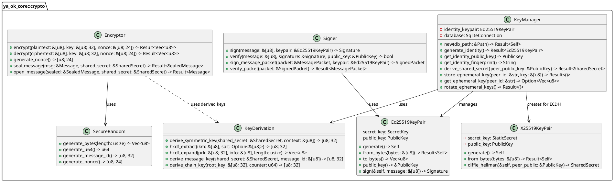

### 2.3 Key Generation Flow

```mermaid
stateDiagram-v2
    [*] --> CheckExisting: App First Launch
    CheckExisting --> GenerateIdentity: No Identity Found
    CheckExisting --> LoadIdentity: Identity Exists
    
    GenerateIdentity --> GenerateEd25519: Create Identity Keypair
    GenerateEd25519 --> ComputeFingerprint: ed25519_dalek::generate()
    ComputeFingerprint --> StoreToDatabase: SHA-256(public_key)
    StoreToDatabase --> LoadIdentity: INSERT INTO identities
    
    LoadIdentity --> Ready: Keys Loaded
    Ready --> [*]
    
    Ready --> GenerateEphemeral: Peer Connection Request
    GenerateEphemeral --> ECDH: X25519 keypair
    ECDH --> DeriveSharedSecret: diffie_hellman()
    DeriveSharedSecret --> HKDF: Use peer's public key
    HKDF --> StoreSessionKey: HKDF-SHA256
    StoreSessionKey --> Ready: Session established
```

**Pseudocode: Identity Key Generation**

```rust
fn generate_identity() -> Result<Ed25519KeyPair> {
    // 1. Generate cryptographically secure random bytes (32 bytes)
    let mut rng = SecureRandom::new();
    let secret_bytes = rng.generate_bytes(32);
    
    // 2. Create Ed25519 keypair from secret
    let keypair = Ed25519KeyPair::from_bytes(&secret_bytes)?;
    
    // 3. Compute fingerprint (SHA-256 hash of public key)
    let fingerprint = sha256_hash(keypair.public_key().as_bytes());
    let fingerprint_hex = hex::encode(&fingerprint[..8]); // First 8 bytes
    
    // 4. Store to database (encrypted with SQLCipher)
    self.database.execute(
        "INSERT INTO identities (public_key, secret_key, fingerprint, created_at) 
         VALUES (?1, ?2, ?3, ?4)",
        params![
            keypair.public_key().as_bytes(),
            keypair.secret_key().as_bytes(),
            fingerprint_hex,
            current_timestamp()
        ]
    )?;
    
    // 5. Return keypair for in-memory use
    Ok(keypair)
}
```

### 2.4 Encryption Flow

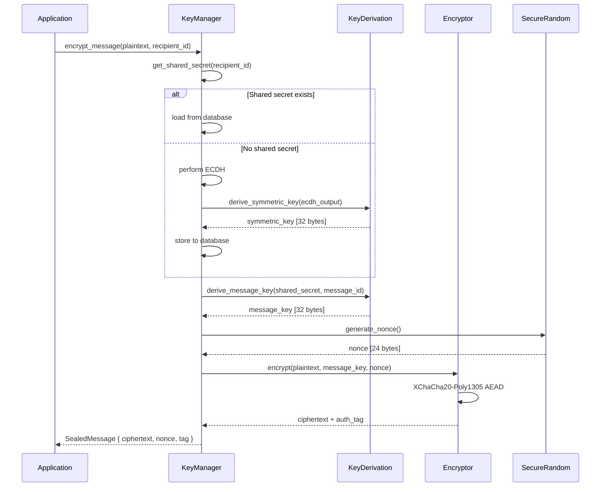

**Pseudocode: Message Encryption**

```rust
fn encrypt_message(plaintext: &[u8], recipient_id: &str) -> Result<SealedMessage> {
    // 1. Get or establish shared secret with recipient
    let shared_secret = self.get_or_establish_shared_secret(recipient_id)?;
    
    // 2. Generate unique message ID (Blake2b hash)
    let message_id = blake2b_hash(&[
        plaintext,
        recipient_id.as_bytes(),
        &current_timestamp().to_le_bytes()
    ]);
    
    // 3. Derive message-specific key using HKDF
    let message_key = KeyDerivation::derive_message_key(
        &shared_secret,
        &message_id
    );
    
    // 4. Generate random nonce (24 bytes for XChaCha20)
    let nonce = SecureRandom::generate_nonce();
    
    // 5. Encrypt with XChaCha20-Poly1305 AEAD
    // Returns: ciphertext || authentication_tag (16 bytes)
    let sealed = XChaCha20Poly1305::encrypt(
        &message_key,
        &nonce,
        plaintext,
        &[] // No additional authenticated data
    )?;
    
    // 6. Package sealed message
    Ok(SealedMessage {
        ciphertext: sealed[..sealed.len() - 16].to_vec(),
        nonce: nonce,
        auth_tag: sealed[sealed.len() - 16..].try_into()?,
        message_id: message_id
    })
}
```

### 2.5 Key Derivation (HKDF)

**HKDF Process**:

```
Input:
  - IKM (Input Keying Material): ECDH shared secret (32 bytes)
  - Salt: Optional, defaults to string of zeros
  - Info: Context string (e.g., "ya_ok_message_key_v1")
  - Length: Desired output length (32 bytes for XChaCha20-Poly1305)

Step 1: Extract
  PRK = HMAC-SHA256(Salt, IKM)

Step 2: Expand
  T(0) = empty
  T(1) = HMAC-SHA256(PRK, T(0) || Info || 0x01)
  T(2) = HMAC-SHA256(PRK, T(1) || Info || 0x02)
  ...
  OKM = first L bytes of T(1) || T(2) || ...

Output: OKM (Output Keying Material, 32 bytes)
```

**Rust Implementation**:

```rust
fn derive_symmetric_key(shared_secret: &SharedSecret, context: &[u8]) -> [u8; 32] {
    // Use HKDF-SHA256 for key derivation
    let hkdf = Hkdf::<Sha256>::new(None, shared_secret.as_bytes());
    
    let mut output_key = [0u8; 32];
    hkdf.expand(context, &mut output_key)
        .expect("HKDF expand failed");
    
    output_key
}

fn derive_message_key(shared_secret: &SharedSecret, message_id: &[u8]) -> [u8; 32] {
    // Context includes message ID for unique per-message keys
    let context = [b"ya_ok_msg_v1", message_id].concat();
    Self::derive_symmetric_key(shared_secret, &context)
}

fn derive_chain_key(root_key: &[u8; 32], counter: u64) -> [u8; 32] {
    // For ratcheting: derive next chain key from current
    let context = [b"ya_ok_chain_v1", &counter.to_le_bytes()].concat();
    
    let hkdf = Hkdf::<Sha256>::new(None, root_key);
    let mut chain_key = [0u8; 32];
    hkdf.expand(&context, &mut chain_key)
        .expect("Chain key derivation failed");
    
    chain_key
}
```

### 2.6 Digital Signatures

**Signing Process**:

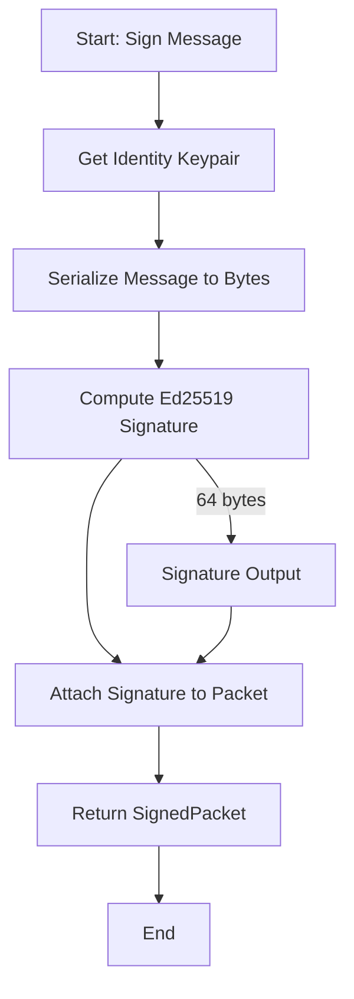

**Verification Process**:

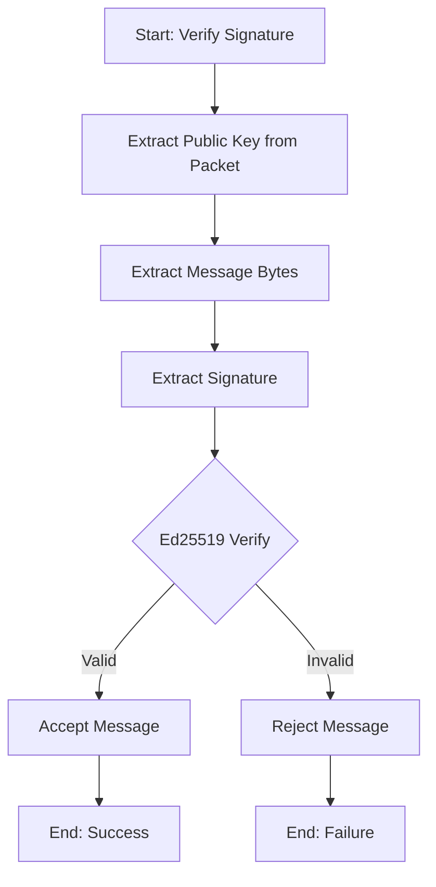

**Pseudocode**:

```rust
fn sign_message_packet(packet: &MessagePacket, keypair: &Ed25519KeyPair) -> SignedPacket {
    // 1. Serialize packet to canonical bytes
    let packet_bytes = bincode::serialize(&packet).unwrap();
    
    // 2. Compute Ed25519 signature (64 bytes)
    let signature = keypair.sign(&packet_bytes);
    
    // 3. Create signed packet
    SignedPacket {
        packet: packet.clone(),
        signature: signature.to_bytes(),
        signer_public_key: keypair.public_key().to_bytes()
    }
}

fn verify_packet(signed_packet: &SignedPacket) -> Result<MessagePacket> {
    // 1. Deserialize public key
    let public_key = PublicKey::from_bytes(&signed_packet.signer_public_key)?;
    
    // 2. Serialize packet for verification
    let packet_bytes = bincode::serialize(&signed_packet.packet)?;
    
    // 3. Verify signature
    let signature = Signature::from_bytes(&signed_packet.signature)?;
    let valid = public_key.verify(&packet_bytes, &signature).is_ok();
    
    if valid {
        Ok(signed_packet.packet.clone())
    } else {
        Err(CryptoError::InvalidSignature)
    }
}
```

### 2.7 State Machine: Key Lifecycle

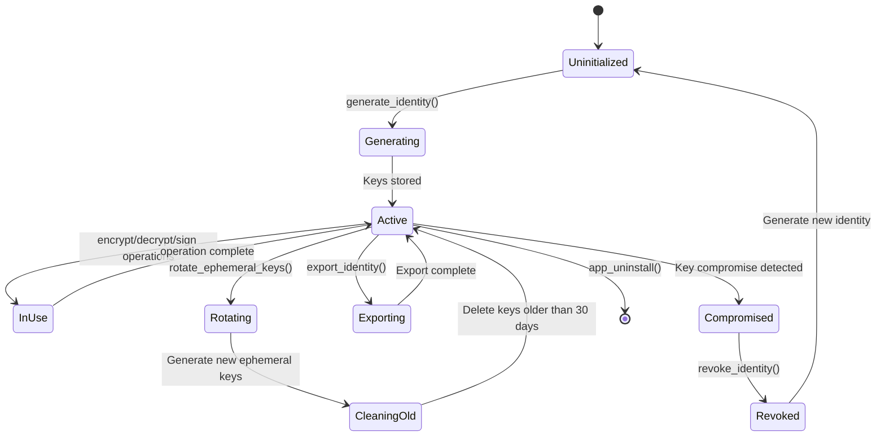

### 2.8 Error Handling

```rust
#[derive(Debug, thiserror::Error)]
pub enum CryptoError {
    #[error("Failed to generate random bytes")]
    RandomGenerationFailed,
    
    #[error("Invalid key format: {0}")]
    InvalidKeyFormat(String),
    
    #[error("Encryption failed: {0}")]
    EncryptionFailed(String),
    
    #[error("Decryption failed: authentication tag mismatch")]
    DecryptionFailed,
    
    #[error("Invalid signature")]
    InvalidSignature,
    
    #[error("Key not found: {0}")]
    KeyNotFound(String),
    
    #[error("ECDH failed: {0}")]
    ECDHFailed(String),
    
    #[error("HKDF failed: {0}")]
    HKDFailed(String),
    
    #[error("Database error: {0}")]
    DatabaseError(#[from] rusqlite::Error),
}
```

---

## 3. Component 2: Transport Layer

### 3.1 Overview

The Transport Layer manages peer discovery and message transmission across multiple network transports: BLE (Bluetooth Low Energy), WiFi Direct, and UDP relay server.

**Location**: `ya_ok_core/src/transport/`

**Primary Responsibilities**:
- Peer discovery via BLE advertising and WiFi Direct NSD
- Connection establishment and management
- Transport selection based on availability and quality
- Message queuing and transmission
- Automatic retry with exponential backoff
- Transport-agnostic interface for upper layers

### 3.2 Class Diagram

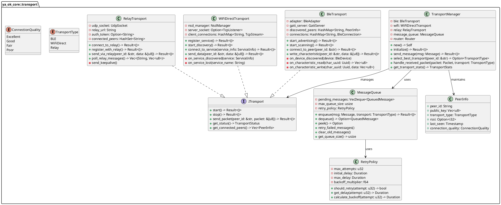

### 3.3 BLE Discovery Flow

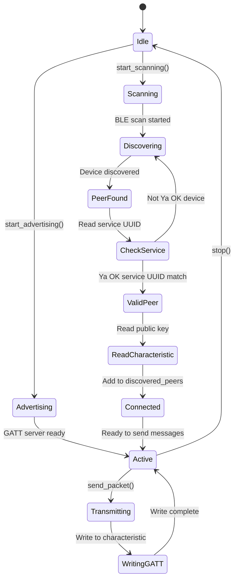

**GATT Profile**:

```
Service UUID: 6ba1b218-15a8-461f-9fa8-5dcae273eafd (Ya OK Messaging)
├── Characteristic UUID: 6ba1b219-15a8-461f-9fa8-5dcae273eafd (Public Key)
│   Properties: READ
│   Value: 32-byte Ed25519 public key
│
├── Characteristic UUID: 6ba1b21a-15a8-461f-9fa8-5dcae273eafd (Message Inbox)
│   Properties: WRITE, NOTIFY
│   Value: Encrypted message packet (max 512 bytes)
│
└── Characteristic UUID: 6ba1b21b-15a8-461f-9fa8-5dcae273eafd (Status)
    Properties: READ, NOTIFY
    Value: Connection status byte
```

**Pseudocode: BLE Message Transmission**

```rust
async fn send_via_ble(peer_id: &str, packet: &[u8]) -> Result<()> {
    // 1. Check if peer is connected
    let connection = self.connections.get(peer_id)
        .ok_or(TransportError::PeerNotConnected)?;
    
    // 2. Split packet into chunks if needed (BLE MTU = 512 bytes)
    const MAX_CHUNK_SIZE: usize = 512;
    let chunks = packet.chunks(MAX_CHUNK_SIZE);
    
    // 3. Send chunks sequentially
    for (index, chunk) in chunks.enumerate() {
        // Prepend chunk header: [chunk_index: u16][total_chunks: u16][data]
        let total_chunks = (packet.len() + MAX_CHUNK_SIZE - 1) / MAX_CHUNK_SIZE;
        let mut chunk_packet = Vec::new();
        chunk_packet.extend_from_slice(&(index as u16).to_le_bytes());
        chunk_packet.extend_from_slice(&(total_chunks as u16).to_le_bytes());
        chunk_packet.extend_from_slice(chunk);
        
        // Write to GATT characteristic
        connection.write_characteristic(
            MESSAGE_INBOX_UUID,
            &chunk_packet
        ).await?;
        
        // Wait for acknowledgment (read status characteristic)
        let status = connection.read_characteristic(STATUS_UUID).await?;
        if status[0] != ACK_BYTE {
            return Err(TransportError::TransmissionFailed);
        }
    }
    
    Ok(())
}
```

### 3.4 WiFi Direct Discovery

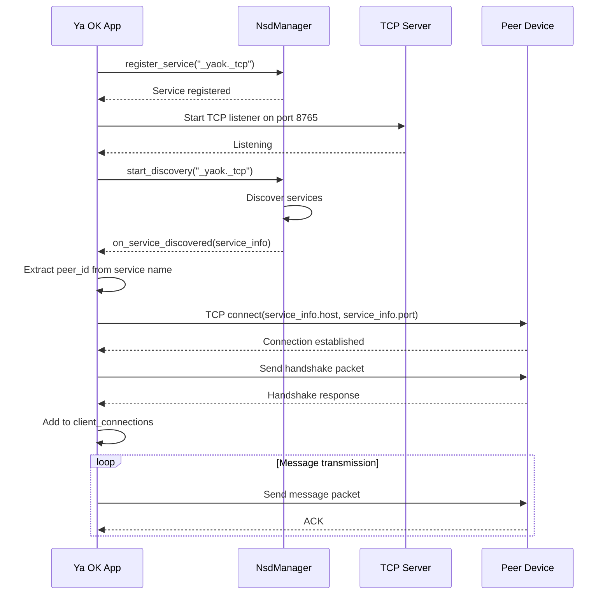

**Service Registration**:

```rust
fn register_service() -> Result<()> {
    let service_name = format!("yaok-{}", self.identity_fingerprint);
    let service_type = "_yaok._tcp.";
    let port = 8765;
    
    let txt_records = HashMap::from([
        ("version", "1.0"),
        ("protocol", "yaok-p2p"),
        ("pubkey", &hex::encode(self.public_key))
    ]);
    
    self.nsd_manager.register_service(
        service_name,
        service_type,
        port,
        txt_records
    )?;
    
    Ok(())
}
```

**TCP Message Format**:

```
[4 bytes: Packet length (little-endian)]
[1 byte: Protocol version (0x01)]
[1 byte: Message type (0x01 = message, 0x02 = handshake, 0x03 = ack)]
[32 bytes: Sender public key]
[Variable: Encrypted payload]
```

### 3.5 Relay Protocol

**UDP Packet Structure**:

```
Client → Relay:
┌─────────────────────────────────────────────────┐
│ Magic (4 bytes): 0x59414F4B ("YAOK")            │
├─────────────────────────────────────────────────┤
│ Version (1 byte): 0x01                          │
├─────────────────────────────────────────────────┤
│ Message Type (1 byte):                          │
│   0x01 = REGISTER                               │
│   0x02 = MESSAGE                                │
│   0x03 = KEEPALIVE                              │
│   0x04 = QUERY_PEER                             │
├─────────────────────────────────────────────────┤
│ Sender ID (32 bytes): SHA-256(public_key)       │
├─────────────────────────────────────────────────┤
│ Recipient ID (32 bytes): SHA-256(public_key)    │
│   (All zeros for REGISTER/KEEPALIVE)            │
├─────────────────────────────────────────────────┤
│ Sequence Number (8 bytes): u64 LE               │
├─────────────────────────────────────────────────┤
│ Timestamp (8 bytes): Unix timestamp (u64 LE)    │
├─────────────────────────────────────────────────┤
│ Payload Length (4 bytes): u32 LE                │
├─────────────────────────────────────────────────┤
│ Payload (variable): Encrypted message           │
└─────────────────────────────────────────────────┘

Relay → Client:
┌─────────────────────────────────────────────────┐
│ Magic (4 bytes): 0x59414F4B ("YAOK")            │
├─────────────────────────────────────────────────┤
│ Version (1 byte): 0x01                          │
├─────────────────────────────────────────────────┤
│ Message Type (1 byte):                          │
│   0x10 = ACK                                    │
│   0x11 = MESSAGE_DELIVERY                       │
│   0x12 = ERROR                                  │
│   0x13 = PEER_STATUS                            │
├─────────────────────────────────────────────────┤
│ Status Code (1 byte):                           │
│   0x00 = Success                                │
│   0x01 = Peer offline                           │
│   0x02 = Invalid recipient                      │
│   0x03 = Rate limited                           │
│   0xFF = Internal error                         │
├─────────────────────────────────────────────────┤
│ Sequence Number (8 bytes): Echo from request    │
├─────────────────────────────────────────────────┤
│ Payload Length (4 bytes): u32 LE                │
├─────────────────────────────────────────────────┤
│ Payload (variable): Response data               │
└─────────────────────────────────────────────────┘
```

**Pseudocode: Relay Registration**

```rust
async fn register_with_relay() -> Result<()> {
    // 1. Create UDP socket
    let socket = UdpSocket::bind("0.0.0.0:0").await?;
    socket.connect(&self.relay_url).await?;
    
    // 2. Build REGISTER packet
    let mut packet = Vec::new();
    packet.extend_from_slice(b"YAOK");                    // Magic
    packet.push(0x01);                                     // Version
    packet.push(0x01);                                     // REGISTER
    packet.extend_from_slice(&self.identity_hash);         // Sender ID
    packet.extend_from_slice(&[0u8; 32]);                  // Recipient (zeros)
    packet.extend_from_slice(&self.next_sequence().to_le_bytes());
    packet.extend_from_slice(&current_timestamp().to_le_bytes());
    
    // Payload: public key
    let payload = self.public_key.as_bytes();
    packet.extend_from_slice(&(payload.len() as u32).to_le_bytes());
    packet.extend_from_slice(payload);
    
    // 3. Send packet
    socket.send(&packet).await?;
    
    // 4. Wait for ACK (with timeout)
    let mut response = vec![0u8; 1024];
    let timeout = Duration::from_secs(5);
    
    match tokio::time::timeout(timeout, socket.recv(&mut response)).await {
        Ok(Ok(n)) => {
            let response = &response[..n];
            if response[5] == 0x10 && response[6] == 0x00 {
                // ACK received with success status
                self.connected = true;
                Ok(())
            } else {
                Err(TransportError::RelayRegistrationFailed)
            }
        }
        _ => Err(TransportError::Timeout)
    }
}
```

### 3.6 Transport Selection Algorithm

```rust
fn select_best_transport(peer_id: &str) -> Option<TransportType> {
    let mut candidates = Vec::new();
    
    // Check BLE availability and quality
    if let Some(ble_peer) = self.ble.get_peer_info(peer_id) {
        let score = calculate_transport_score(
            &ble_peer,
            TransportType::BLE
        );
        candidates.push((TransportType::BLE, score));
    }
    
    // Check WiFi Direct availability
    if let Some(wifi_peer) = self.wifi.get_peer_info(peer_id) {
        let score = calculate_transport_score(
            &wifi_peer,
            TransportType::WiFiDirect
        );
        candidates.push((TransportType::WiFiDirect, score));
    }
    
    // Check relay availability (always available if connected)
    if self.relay.is_connected() {
        let score = calculate_relay_score();
        candidates.push((TransportType::Relay, score));
    }
    
    // Select transport with highest score
    candidates.into_iter()
        .max_by_key(|(_, score)| *score)
        .map(|(transport, _)| transport)
}

fn calculate_transport_score(peer: &PeerInfo, transport_type: TransportType) -> u32 {
    let mut score = 0u32;
    
    // Connection quality (0-40 points)
    score += match peer.connection_quality {
        ConnectionQuality::Excellent => 40,
        ConnectionQuality::Good => 30,
        ConnectionQuality::Fair => 20,
        ConnectionQuality::Poor => 10,
    };
    
    // Transport preferences (0-30 points)
    score += match transport_type {
        TransportType::BLE => 30,        // Prefer local (privacy)
        TransportType::WiFiDirect => 25, // Second choice (speed)
        TransportType::Relay => 15,      // Fallback (requires internet)
    };
    
    // Recency (0-20 points)
    let age = current_time() - peer.last_seen;
    if age < Duration::from_secs(60) {
        score += 20;
    } else if age < Duration::from_secs(300) {
        score += 10;
    }
    
    // RSSI for wireless transports (0-10 points)
    if let Some(rssi) = peer.rssi {
        if rssi > -50 { score += 10; }
        else if rssi > -70 { score += 5; }
    }
    
    score
}
```

### 3.7 Message Queue State Machine

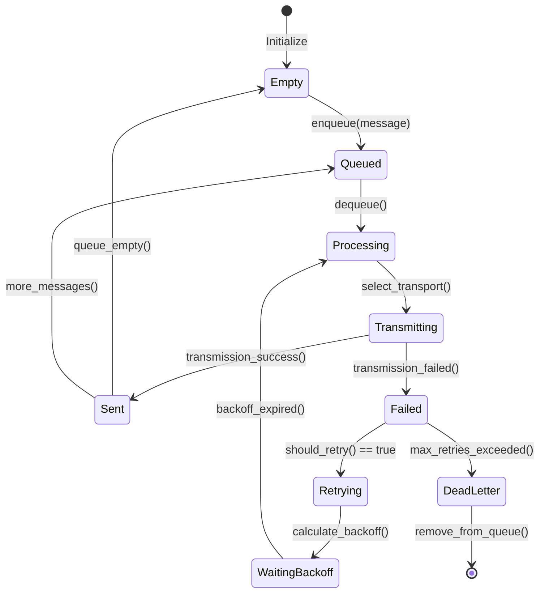

**Retry Policy**:

```rust
impl RetryPolicy {
    pub fn new() -> Self {
        Self {
            max_attempts: 5,
            initial_delay: Duration::from_secs(1),
            max_delay: Duration::from_secs(300), // 5 minutes
            backoff_multiplier: 2.0
        }
    }
    
    pub fn should_retry(&self, attempt: u32) -> bool {
        attempt < self.max_attempts
    }
    
    pub fn get_delay(&self, attempt: u32) -> Duration {
        let delay = self.initial_delay.as_secs_f64() 
            * self.backoff_multiplier.powi(attempt as i32);
        
        Duration::from_secs_f64(delay.min(self.max_delay.as_secs_f64()))
    }
}

// Example: Attempt delays
// Attempt 1: 1 second
// Attempt 2: 2 seconds
// Attempt 3: 4 seconds
// Attempt 4: 8 seconds
// Attempt 5: 16 seconds
```

---

## 4. Component 3: Message Routing

### 4.1 Overview

The Message Routing component implements intelligent routing logic to deliver messages through the most appropriate path: local delivery (same device), peer-to-peer (direct connection), or relay fallback (via server).

**Location**: `ya_ok_core/src/routing/`

**Primary Responsibilities**:
- Route selection based on peer availability
- Local message delivery for multi-identity devices
- P2P routing with transport selection
- Relay fallback for unreachable peers
- DTN (Delay-Tolerant Networking) store-and-forward
- Message ordering and deduplication
- Delivery confirmation tracking

### 4.2 Class Diagram

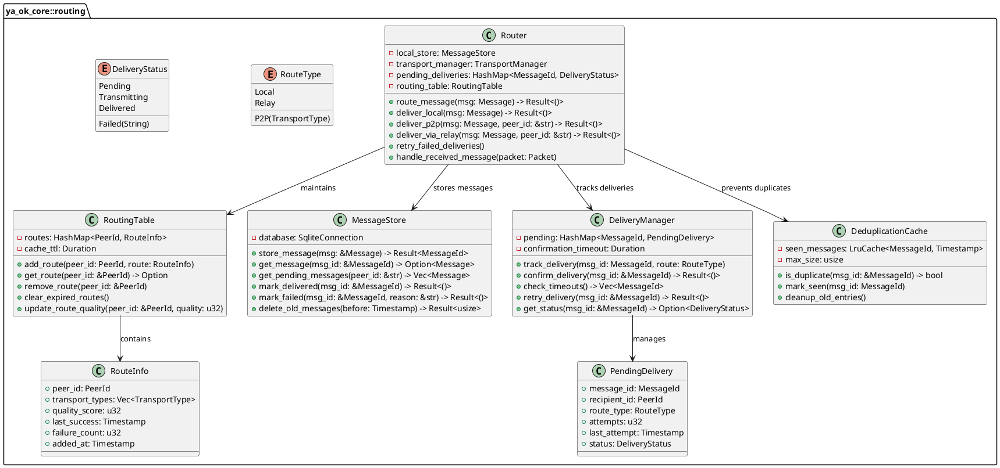

### 4.3 Routing Decision Flow

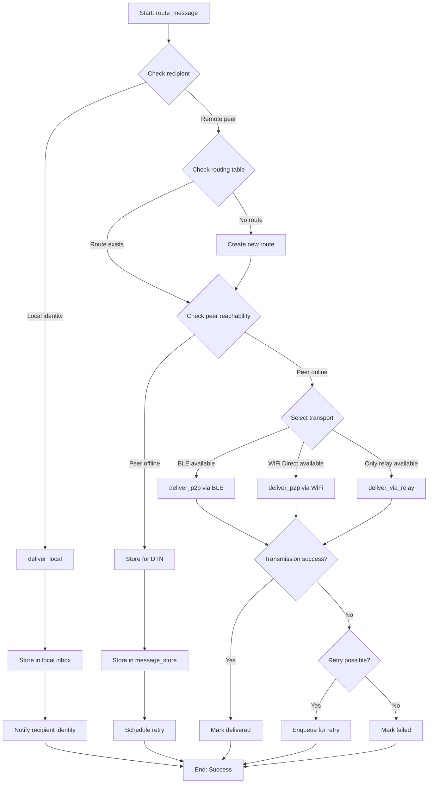

**Pseudocode: Route Selection**

```rust
pub fn route_message(&mut self, msg: Message) -> Result<()> {
    // 1. Check if recipient is a local identity
    if self.is_local_identity(&msg.recipient_id) {
        return self.deliver_local(msg);
    }
    
    // 2. Check for duplicate message
    if self.dedup_cache.is_duplicate(&msg.id) {
        return Ok(()); // Already processed
    }
    self.dedup_cache.mark_seen(msg.id.clone());
    
    // 3. Store message persistently (DTN)
    self.local_store.store_message(&msg)?;
    
    // 4. Get or create route to recipient
    let route = match self.routing_table.get_route(&msg.recipient_id) {
        Some(r) => r.clone(),
        None => self.discover_route(&msg.recipient_id)?
    };
    
    // 5. Check peer reachability
    let peer_status = self.transport_manager.get_peer_status(&msg.recipient_id);
    
    if peer_status.is_online {
        // Attempt direct delivery
        match self.attempt_delivery(&msg, &route) {
            Ok(_) => {
                self.delivery_manager.confirm_delivery(&msg.id)?;
                self.local_store.mark_delivered(&msg.id)?;
                Ok(())
            }
            Err(e) => {
                // Delivery failed, will retry later
                self.delivery_manager.track_delivery(
                    msg.id.clone(),
                    route.get_route_type()
                );
                Err(e)
            }
        }
    } else {
        // Peer offline, store for later delivery (DTN)
        self.delivery_manager.track_delivery(
            msg.id.clone(),
            RouteType::Relay // Will try relay when peer comes online
        );
        Ok(())
    }
}
```

### 4.4 Local Delivery

```rust
fn deliver_local(&mut self, msg: Message) -> Result<()> {
    // 1. Verify recipient identity exists locally
    let recipient_identity = self.identity_manager
        .get_identity(&msg.recipient_id)
        .ok_or(RoutingError::UnknownRecipient)?;
    
    // 2. Decrypt message for recipient
    let plaintext = self.crypto.decrypt_message(
        &msg.ciphertext,
        &recipient_identity
    )?;
    
    // 3. Store in recipient's inbox
    self.local_store.add_to_inbox(
        &msg.recipient_id,
        &msg.id,
        &plaintext,
        &msg.sender_id,
        msg.timestamp
    )?;
    
    // 4. Trigger notification
    self.notification_manager.notify_new_message(
        &msg.recipient_id,
        &msg.sender_id
    );
    
    // 5. Mark as delivered
    self.local_store.mark_delivered(&msg.id)?;
    
    Ok(())
}
```

### 4.5 P2P Delivery

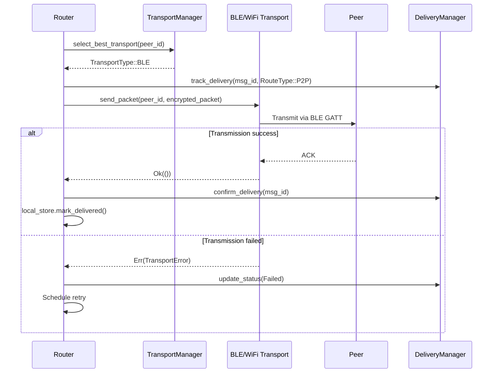

**Pseudocode**:

```rust
async fn deliver_p2p(&mut self, msg: Message, peer_id: &str) -> Result<()> {
    // 1. Select best available transport
    let transport = self.transport_manager
        .select_best_transport(peer_id)
        .ok_or(RoutingError::NoTransportAvailable)?;
    
    // 2. Serialize and encrypt message packet
    let packet = MessagePacket {
        version: PROTOCOL_VERSION,
        message_id: msg.id.clone(),
        sender_id: msg.sender_id.clone(),
        recipient_id: msg.recipient_id.clone(),
        timestamp: msg.timestamp,
        ciphertext: msg.ciphertext.clone(),
        signature: msg.signature.clone()
    };
    
    let serialized = bincode::serialize(&packet)?;
    
    // 3. Track delivery attempt
    self.delivery_manager.track_delivery(
        msg.id.clone(),
        RouteType::P2P(transport)
    );
    
    // 4. Send via selected transport
    match transport {
        TransportType::BLE => {
            self.transport_manager.ble.send_packet(peer_id, &serialized).await?
        }
        TransportType::WiFiDirect => {
            self.transport_manager.wifi.send_packet(peer_id, &serialized).await?
        }
        _ => return Err(RoutingError::InvalidTransport)
    }
    
    // 5. Wait for confirmation (with timeout)
    let timeout = Duration::from_secs(30);
    match tokio::time::timeout(
        timeout,
        self.wait_for_confirmation(&msg.id)
    ).await {
        Ok(Ok(())) => {
            // Confirmed delivered
            self.local_store.mark_delivered(&msg.id)?;
            Ok(())
        }
        _ => {
            // Timeout or error, will retry
            Err(RoutingError::DeliveryTimeout)
        }
    }
}
```

### 4.6 Relay Fallback

```rust
async fn deliver_via_relay(&mut self, msg: Message, peer_id: &str) -> Result<()> {
    // 1. Check relay connection
    if !self.transport_manager.relay.is_connected() {
        self.transport_manager.relay.connect_to_relay().await?;
    }
    
    // 2. Build relay packet
    let relay_packet = RelayPacket {
        magic: b"YAOK".to_vec(),
        version: 0x01,
        message_type: MessageType::MESSAGE,
        sender_id: self.identity_manager.get_current_identity_hash(),
        recipient_id: sha256_hash(peer_id.as_bytes()),
        sequence: self.next_sequence(),
        timestamp: current_timestamp(),
        payload: bincode::serialize(&msg)?
    };
    
    let serialized = relay_packet.serialize();
    
    // 3. Send via UDP
    self.transport_manager.relay.send_via_relay(
        peer_id,
        &serialized
    ).await?;
    
    // 4. Wait for ACK from relay
    let response = tokio::time::timeout(
        Duration::from_secs(10),
        self.transport_manager.relay.wait_for_ack(relay_packet.sequence)
    ).await?;
    
    match response {
        Ok(ack) if ack.status_code == 0x00 => {
            // Relay accepted, delivery will happen when peer online
            self.delivery_manager.track_delivery(
                msg.id.clone(),
                RouteType::Relay
            );
            Ok(())
        }
        Ok(ack) => {
            // Relay error
            Err(RoutingError::RelayError(ack.status_code))
        }
        Err(_) => {
            // Timeout
            Err(RoutingError::RelayTimeout)
        }
    }
}
```

### 4.7 DTN Store-and-Forward

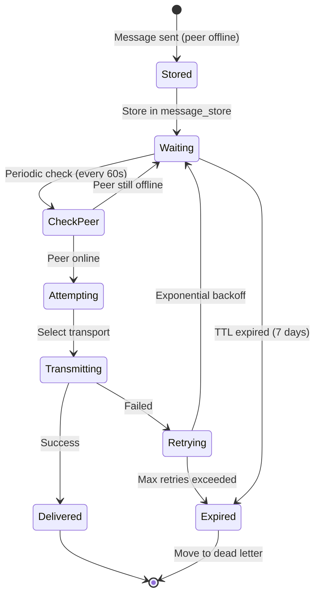

**Pseudocode: DTN Retry**

```rust
async fn retry_failed_deliveries(&mut self) -> Result<()> {
    // 1. Get all pending messages
    let pending = self.local_store.get_all_pending_messages()?;
    
    for msg in pending {
        // 2. Check if retry is due
        let delivery_status = self.delivery_manager.get_status(&msg.id);
        
        if let Some(status) = delivery_status {
            let time_since_attempt = current_time() - status.last_attempt;
            let backoff_delay = self.retry_policy.get_delay(status.attempts);
            
            if time_since_attempt < backoff_delay {
                continue; // Not yet time to retry
            }
        }
        
        // 3. Check message TTL (7 days)
        let age = current_time() - msg.timestamp;
        if age > Duration::from_days(7) {
            self.local_store.mark_failed(&msg.id, "TTL expired")?;
            continue;
        }
        
        // 4. Check peer availability
        let peer_status = self.transport_manager.get_peer_status(&msg.recipient_id);
        
        if peer_status.is_online {
            // 5. Attempt delivery
            match self.route_message(msg).await {
                Ok(_) => {
                    log::info!("DTN message {} delivered after retry", msg.id);
                }
                Err(e) => {
                    log::warn!("DTN retry failed for {}: {:?}", msg.id, e);
                }
            }
        } else {
            // Peer still offline, check relay
            if self.transport_manager.relay.is_connected() {
                match self.deliver_via_relay(msg, &msg.recipient_id).await {
                    Ok(_) => {
                        log::info!("DTN message {} sent to relay", msg.id);
                    }
                    Err(_) => {
                        // Will retry later
                    }
                }
            }
        }
    }
    
    Ok(())
}
```

### 4.8 Message Deduplication

```rust
struct DeduplicationCache {
    seen_messages: LruCache<MessageId, Timestamp>,
    max_size: usize,
}

impl DeduplicationCache {
    pub fn new(max_size: usize) -> Self {
        Self {
            seen_messages: LruCache::new(max_size),
            max_size
        }
    }
    
    pub fn is_duplicate(&self, msg_id: &MessageId) -> bool {
        self.seen_messages.contains(msg_id)
    }
    
    pub fn mark_seen(&mut self, msg_id: MessageId) {
        self.seen_messages.put(msg_id, current_timestamp());
    }
    
    pub fn cleanup_old_entries(&mut self) {
        let now = current_timestamp();
        let expiry_duration = Duration::from_secs(3600); // 1 hour
        
        self.seen_messages.retain(|_, timestamp| {
            now - *timestamp < expiry_duration
        });
    }
}
```

### 4.9 Delivery Confirmation

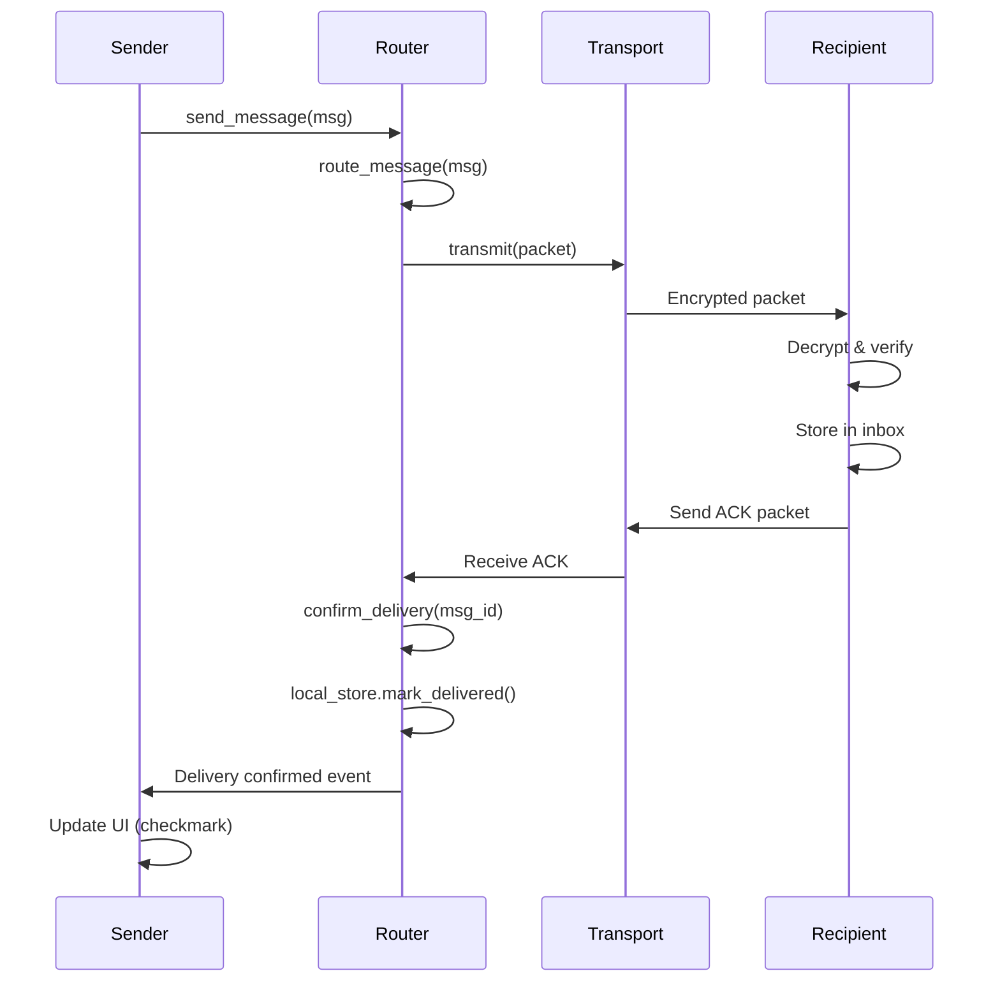

**ACK Packet Structure**:

```rust
struct AckPacket {
    version: u8,
    message_id: MessageId,
    recipient_id: PeerId,
    timestamp: Timestamp,
    signature: Signature // Signed by recipient
}

fn send_ack(msg_id: MessageId, sender_id: &str) -> Result<()> {
    let ack = AckPacket {
        version: PROTOCOL_VERSION,
        message_id: msg_id.clone(),
        recipient_id: self.identity_manager.get_current_identity(),
        timestamp: current_timestamp(),
        signature: self.crypto.sign_packet(&msg_id)?
    };
    
    let serialized = bincode::serialize(&ack)?;
    
    // Send ACK back to sender via same transport
    self.transport_manager.send_to_peer(sender_id, &serialized)?;
    
    Ok(())
}
```

---

## 5. Data Structures

### 5.1 Core Message Structures

```rust
/// Represents an encrypted message in transit
#[derive(Debug, Clone, Serialize, Deserialize)]
pub struct Message {
    /// Unique message identifier (Blake2b hash)
    pub id: MessageId,
    
    /// Sender's identity public key hash
    pub sender_id: PeerId,
    
    /// Recipient's identity public key hash
    pub recipient_id: PeerId,
    
    /// Unix timestamp (seconds since epoch)
    pub timestamp: u64,
    
    /// Encrypted message content (XChaCha20-Poly1305)
    pub ciphertext: Vec<u8>,
    
    /// Nonce used for encryption (24 bytes)
    pub nonce: [u8; 24],
    
    /// Authentication tag (16 bytes)
    pub auth_tag: [u8; 16],
    
    /// Ed25519 signature of the message
    pub signature: Vec<u8>,
    
    /// Message priority (for routing)
    pub priority: MessagePriority,
    
    /// Time-to-live for DTN (seconds)
    pub ttl: u32,
}

#[derive(Debug, Clone, Copy, Serialize, Deserialize)]
pub enum MessagePriority {
    Low = 0,
    Normal = 1,
    High = 2,
    Urgent = 3,
}

pub type MessageId = [u8; 32]; // Blake2b hash
pub type PeerId = String; // Hex-encoded SHA-256 hash of public key
```

### 5.2 Cryptographic Key Structures

```rust
/// Ed25519 keypair for identity and signing
pub struct Ed25519KeyPair {
    pub(crate) secret_key: SecretKey,  // 32 bytes
    pub(crate) public_key: PublicKey,  // 32 bytes
}

/// X25519 keypair for ECDH key exchange
pub struct X25519KeyPair {
    pub(crate) secret_key: StaticSecret, // 32 bytes
    pub(crate) public_key: PublicKey,    // 32 bytes
}

/// Shared secret derived from ECDH
pub struct SharedSecret {
    pub(crate) bytes: [u8; 32],
}

/// Symmetric encryption key (XChaCha20-Poly1305)
pub struct SymmetricKey {
    pub(crate) key: [u8; 32],
}
```

### 5.3 Transport Structures

```rust
#[derive(Debug, Clone)]
pub struct PeerInfo {
    /// Unique peer identifier
    pub peer_id: PeerId,
    
    /// Ed25519 public key (32 bytes)
    pub public_key: Vec<u8>,
    
    /// Available transport types
    pub transport_types: Vec<TransportType>,
    
    /// RSSI (signal strength) for wireless transports
    pub rssi: Option<i32>,
    
    /// Last time peer was seen
    pub last_seen: Timestamp,
    
    /// Connection quality assessment
    pub connection_quality: ConnectionQuality,
    
    /// Display name (optional, from contact)
    pub display_name: Option<String>,
}

#[derive(Debug, Clone, Copy, Serialize, Deserialize)]
pub enum TransportType {
    BLE,
    WiFiDirect,
    Relay,
}

#[derive(Debug, Clone, Copy)]
pub enum ConnectionQuality {
    Excellent, // RSSI > -50 dBm, latency < 50ms
    Good,      // RSSI > -70 dBm, latency < 100ms
    Fair,      // RSSI > -85 dBm, latency < 200ms
    Poor,      // RSSI <= -85 dBm, latency >= 200ms
}
```

### 5.4 Routing Structures

```rust
#[derive(Debug, Clone)]
pub struct RouteInfo {
    pub peer_id: PeerId,
    pub transport_types: Vec<TransportType>,
    pub quality_score: u32,
    pub last_success: Timestamp,
    pub failure_count: u32,
    pub added_at: Timestamp,
}

#[derive(Debug, Clone)]
pub struct PendingDelivery {
    pub message_id: MessageId,
    pub recipient_id: PeerId,
    pub route_type: RouteType,
    pub attempts: u32,
    pub last_attempt: Timestamp,
    pub status: DeliveryStatus,
}

#[derive(Debug, Clone)]
pub enum RouteType {
    Local,
    P2P(TransportType),
    Relay,
}

#[derive(Debug, Clone)]
pub enum DeliveryStatus {
    Pending,
    Transmitting,
    Delivered,
    Failed(String),
}
```

### 5.5 Database Schema

```sql
-- Identities table
CREATE TABLE identities (
    id INTEGER PRIMARY KEY AUTOINCREMENT,
    public_key BLOB NOT NULL UNIQUE,
    secret_key BLOB NOT NULL,
    fingerprint TEXT NOT NULL UNIQUE,
    display_name TEXT,
    created_at INTEGER NOT NULL,
    is_active INTEGER DEFAULT 1
);

-- Messages table
CREATE TABLE messages (
    id BLOB PRIMARY KEY,
    sender_id TEXT NOT NULL,
    recipient_id TEXT NOT NULL,
    timestamp INTEGER NOT NULL,
    ciphertext BLOB NOT NULL,
    nonce BLOB NOT NULL,
    auth_tag BLOB NOT NULL,
    signature BLOB NOT NULL,
    status TEXT NOT NULL, -- 'pending', 'delivered', 'failed'
    retry_count INTEGER DEFAULT 0,
    created_at INTEGER NOT NULL
);

CREATE INDEX idx_messages_recipient ON messages(recipient_id);
CREATE INDEX idx_messages_status ON messages(status);
CREATE INDEX idx_messages_timestamp ON messages(timestamp);

-- Contacts table
CREATE TABLE contacts (
    id INTEGER PRIMARY KEY AUTOINCREMENT,
    public_key BLOB NOT NULL UNIQUE,
    fingerprint TEXT NOT NULL UNIQUE,
    display_name TEXT,
    added_at INTEGER NOT NULL
);

-- Shared secrets table (ephemeral keys)
CREATE TABLE shared_secrets (
    peer_id TEXT PRIMARY KEY,
    shared_secret BLOB NOT NULL,
    created_at INTEGER NOT NULL,
    last_used INTEGER NOT NULL
);

-- Peer info cache
CREATE TABLE peer_cache (
    peer_id TEXT PRIMARY KEY,
    public_key BLOB NOT NULL,
    transport_types TEXT NOT NULL, -- JSON array
    last_seen INTEGER NOT NULL,
    rssi INTEGER,
    connection_quality TEXT
);
```

---

## 6. Error Handling

### 6.1 Error Types

```rust
#[derive(Debug, thiserror::Error)]
pub enum YaOkError {
    #[error("Cryptographic error: {0}")]
    Crypto(#[from] CryptoError),
    
    #[error("Transport error: {0}")]
    Transport(#[from] TransportError),
    
    #[error("Routing error: {0}")]
    Routing(#[from] RoutingError),
    
    #[error("Database error: {0}")]
    Database(#[from] rusqlite::Error),
    
    #[error("Serialization error: {0}")]
    Serialization(#[from] bincode::Error),
    
    #[error("IO error: {0}")]
    Io(#[from] std::io::Error),
}

#[derive(Debug, thiserror::Error)]
pub enum CryptoError {
    #[error("Random generation failed")]
    RandomGenerationFailed,
    
    #[error("Invalid key format: {0}")]
    InvalidKeyFormat(String),
    
    #[error("Encryption failed: {0}")]
    EncryptionFailed(String),
    
    #[error("Decryption failed: authentication tag mismatch")]
    DecryptionFailed,
    
    #[error("Invalid signature")]
    InvalidSignature,
    
    #[error("Key not found: {0}")]
    KeyNotFound(String),
}

#[derive(Debug, thiserror::Error)]
pub enum TransportError {
    #[error("Peer not connected: {0}")]
    PeerNotConnected(String),
    
    #[error("Transmission failed: {0}")]
    TransmissionFailed(String),
    
    #[error("No transport available")]
    NoTransportAvailable,
    
    #[error("BLE error: {0}")]
    BleError(String),
    
    #[error("WiFi Direct error: {0}")]
    WiFiDirectError(String),
    
    #[error("Relay connection failed")]
    RelayConnectionFailed,
    
    #[error("Timeout")]
    Timeout,
}

#[derive(Debug, thiserror::Error)]
pub enum RoutingError {
    #[error("Unknown recipient: {0}")]
    UnknownRecipient(String),
    
    #[error("No route to peer: {0}")]
    NoRoute(String),
    
    #[error("Delivery timeout")]
    DeliveryTimeout,
    
    #[error("Message expired (TTL)")]
    MessageExpired,
    
    #[error("Duplicate message")]
    DuplicateMessage,
    
    #[error("Relay error: status code {0}")]
    RelayError(u8),
}
```

### 6.2 Error Recovery Strategies

```rust
impl Router {
    fn handle_routing_error(&mut self, error: RoutingError, msg: &Message) {
        match error {
            RoutingError::NoRoute(_) => {
                // Attempt to discover new route
                if let Ok(route) = self.discover_route(&msg.recipient_id) {
                    self.routing_table.add_route(msg.recipient_id.clone(), route);
                    // Retry delivery
                    let _ = self.route_message(msg.clone());
                }
            }
            
            RoutingError::DeliveryTimeout => {
                // Increment retry count and schedule retry
                self.delivery_manager.retry_delivery(&msg.id).ok();
            }
            
            RoutingError::MessageExpired => {
                // Move to dead letter queue
                self.local_store.mark_failed(&msg.id, "TTL expired").ok();
            }
            
            RoutingError::RelayError(code) if code == 0x03 => {
                // Rate limited, back off
                tokio::time::sleep(Duration::from_secs(60)).await;
            }
            
            _ => {
                log::error!("Unrecoverable routing error: {:?}", error);
            }
        }
    }
}
```

---

## 7. Performance Considerations

### 7.1 Cryptographic Operations

**Benchmarks** (on ARM Cortex-A53, 1.4 GHz):

| Operation | Time | Notes |
|-----------|------|-------|
| Ed25519 key generation | ~1.2 ms | One-time on install |
| Ed25519 signing | ~0.8 ms | Per message sent |
| Ed25519 verification | ~1.5 ms | Per message received |
| X25519 ECDH | ~0.9 ms | Per new peer connection |
| XChaCha20-Poly1305 encryption (1 KB) | ~0.15 ms | Per message |
| XChaCha20-Poly1305 decryption (1 KB) | ~0.16 ms | Per message |
| HKDF key derivation | ~0.05 ms | Per message |
| Blake2b hash (1 KB) | ~0.08 ms | Message ID generation |

**Optimizations**:
- Pre-compute shared secrets on peer connection
- Cache derived message keys (LRU cache, 1000 entries)
- Use hardware-accelerated crypto when available (AES-NI, NEON)
- Batch signature verification for multiple messages

### 7.2 Transport Layer

**BLE Performance**:
- MTU: 512 bytes per packet
- Throughput: ~50 KB/s (BLE 4.2), ~100 KB/s (BLE 5.0)
- Latency: 50-200 ms per packet
- Range: 10-30 meters

**WiFi Direct Performance**:
- Throughput: 1-10 MB/s (depending on signal)
- Latency: 10-50 ms
- Range: 50-100 meters

**Relay Performance**:
- Throughput: Limited by internet connection
- Latency: 100-500 ms (depending on location)
- Unlimited range

**Optimizations**:
- Connection pooling for WiFi Direct
- Message batching (send multiple messages in one packet)
- Compression for large messages (zstd)
- Adaptive MTU for BLE based on connection quality

### 7.3 Database Operations

**SQLCipher Performance**:
- Insert message: ~2 ms
- Query messages: ~5 ms (with index)
- Update status: ~1 ms
- Vacuum (cleanup): ~500 ms (periodic, every 7 days)

**Optimizations**:
- Batch inserts using transactions
- Prepared statements for frequent queries
- Index on message status and recipient_id
- Auto-vacuum for space reclamation
- Write-ahead logging (WAL) mode

### 7.4 Memory Usage

**Typical Memory Footprint**:
- Rust core library: ~8 MB
- Message queue (100 messages): ~500 KB
- Routing table (500 peers): ~200 KB
- Deduplication cache (10,000 entries): ~400 KB
- SQLCipher database: ~50 MB (10,000 messages)

**Optimizations**:
- Lazy loading of messages from database
- LRU caching for frequently accessed data
- Streaming encryption/decryption for large files
- Periodic garbage collection of old messages

---

## 8. Appendices

### 8.1 Algorithm Complexity

| Operation | Time Complexity | Space Complexity |
|-----------|-----------------|------------------|
| Message encryption | O(n) | O(n) |
| Message decryption | O(n) | O(n) |
| Signature generation | O(1) | O(1) |
| Signature verification | O(1) | O(1) |
| Route lookup | O(1) avg | O(m) |
| Peer discovery (BLE) | O(n) | O(n) |
| Transport selection | O(k) | O(1) |
| Message queue enqueue | O(1) | O(1) |
| Message queue dequeue | O(1) | O(1) |
| Deduplication check | O(1) avg | O(d) |

Where:
- n = message size
- m = number of routes in routing table
- k = number of available transports (typically 1-3)
- d = deduplication cache size

### 8.2 Security Analysis

**Threat Mitigations**:

1. **Eavesdropping**: All messages encrypted with XChaCha20-Poly1305 AEAD
2. **Man-in-the-Middle**: Public key fingerprint verification by users
3. **Replay attacks**: Deduplication cache based on message IDs (Blake2b hash includes timestamp)
4. **Message tampering**: Authenticated encryption (Poly1305 MAC) + Ed25519 signatures
5. **Key compromise**: Ephemeral keys with periodic rotation (30 days)
6. **Traffic analysis**: BLE/WiFi Direct reduce metadata leakage, relay uses UDP (no persistent connections)
7. **Device compromise**: SQLCipher encryption at rest, secure key storage (Android Keystore, iOS Keychain)

**Known Limitations**:

1. No forward secrecy (requires Signal Protocol double ratchet)
2. Fingerprint verification relies on out-of-band channels (QR codes, voice)
3. Relay server can observe metadata (sender IP, timestamp, recipient ID)
4. BLE/WiFi Direct discovery exposes presence information

### 8.3 Future Enhancements

**Planned Improvements**:

1. **Signal Protocol Integration**:
   - Double ratchet for forward secrecy
   - Prekeys for asynchronous messaging
   - Session ratcheting

2. **Improved DTN**:
   - Epidemic routing for mesh networks
   - Priority-based message forwarding
   - Custody transfer acknowledgments

3. **Enhanced Transport**:
   - BLE mesh networking
   - LoRa support for long-range communication
   - Tor integration for relay anonymity

4. **Advanced Cryptography**:
   - Post-quantum key exchange (Kyber)
   - Zero-knowledge proofs for authentication
   - Homomorphic encryption for server-side processing

### 8.4 Testing Recommendations

**Unit Tests**:
- Cryptographic operations (encryption, signing, HKDF)
- Message serialization/deserialization
- Routing logic (local, P2P, relay)
- Error handling and recovery

**Integration Tests**:
- End-to-end message delivery (all transport types)
- Multi-device scenarios
- Network interruption and recovery
- DTN store-and-forward

**Performance Tests**:
- Throughput (messages per second)
- Latency (message delivery time)
- Memory usage under load
- Battery consumption

**Security Tests**:
- Penetration testing (message interception, tampering)
- Cryptographic validation (AEAD, signatures)
- Key management security
- Compliance verification (OWASP MASVS L2)

---

## Approval

| **Role** | **Name** | **Signature** | **Date** |
|----------|----------|---------------|----------|
| **Technical Lead** | ___________________ | ___________________ | __________ |
| **Security Architect** | ___________________ | ___________________ | __________ |
| **Mobile Team Lead** | ___________________ | ___________________ | __________ |
| **QA Lead** | ___________________ | ___________________ | __________ |

---

**Document Revision History**:

| **Version** | **Date** | **Author** | **Changes** |
|-------------|----------|------------|-------------|
| 1.0 | 2026-02-07 | Ya OK Team | Initial low-level design document |

---

**End of Document**
