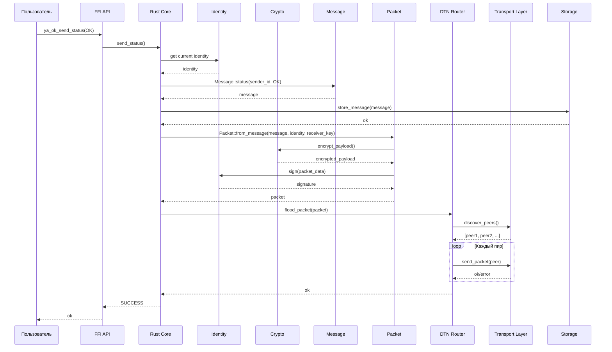
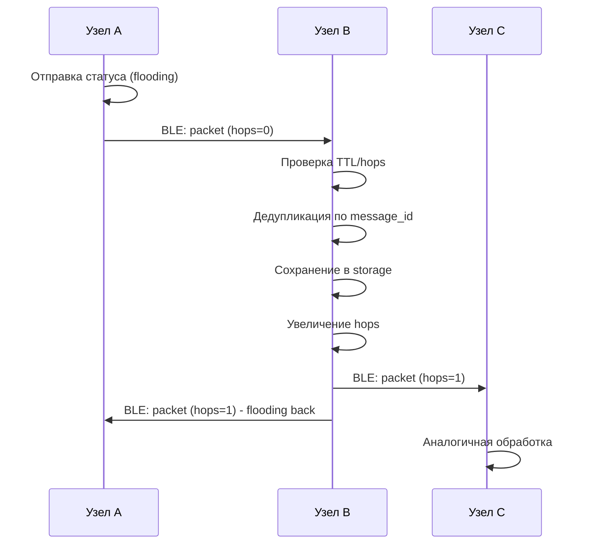
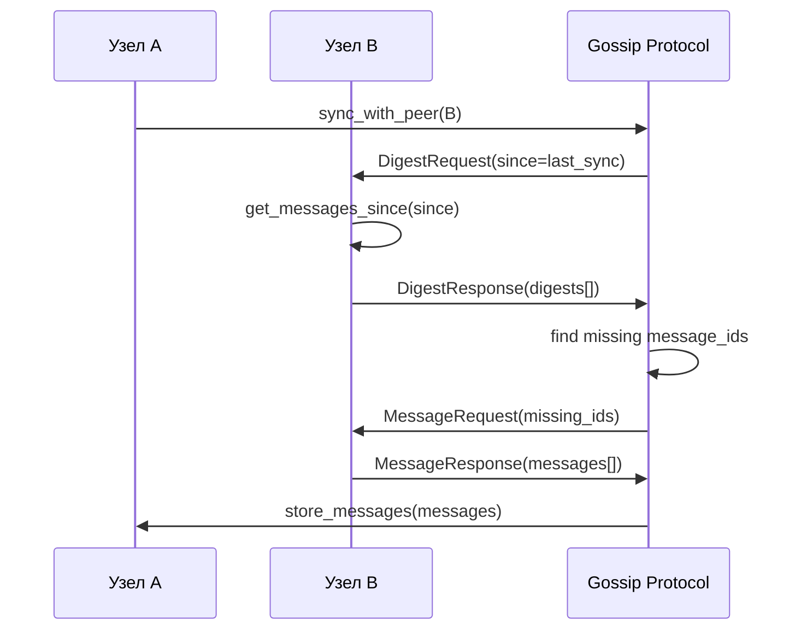
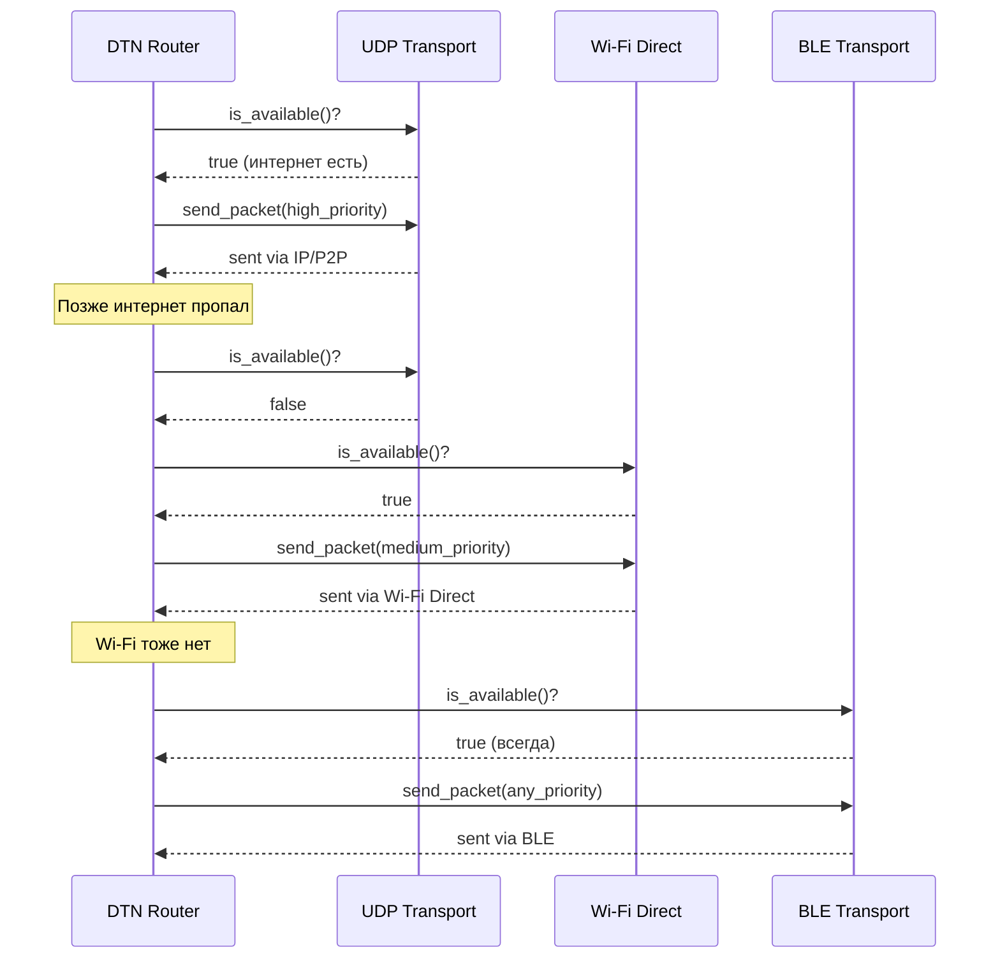
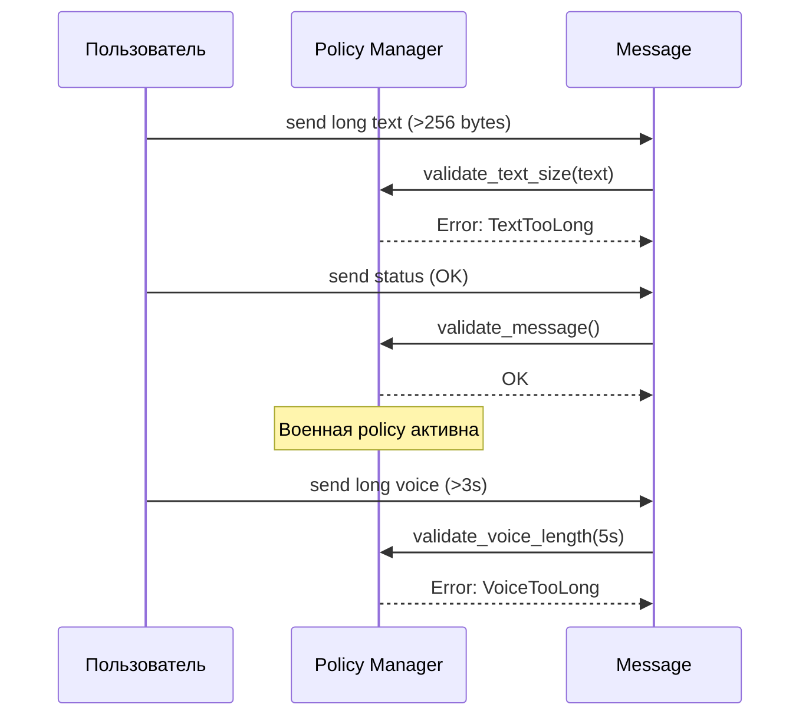
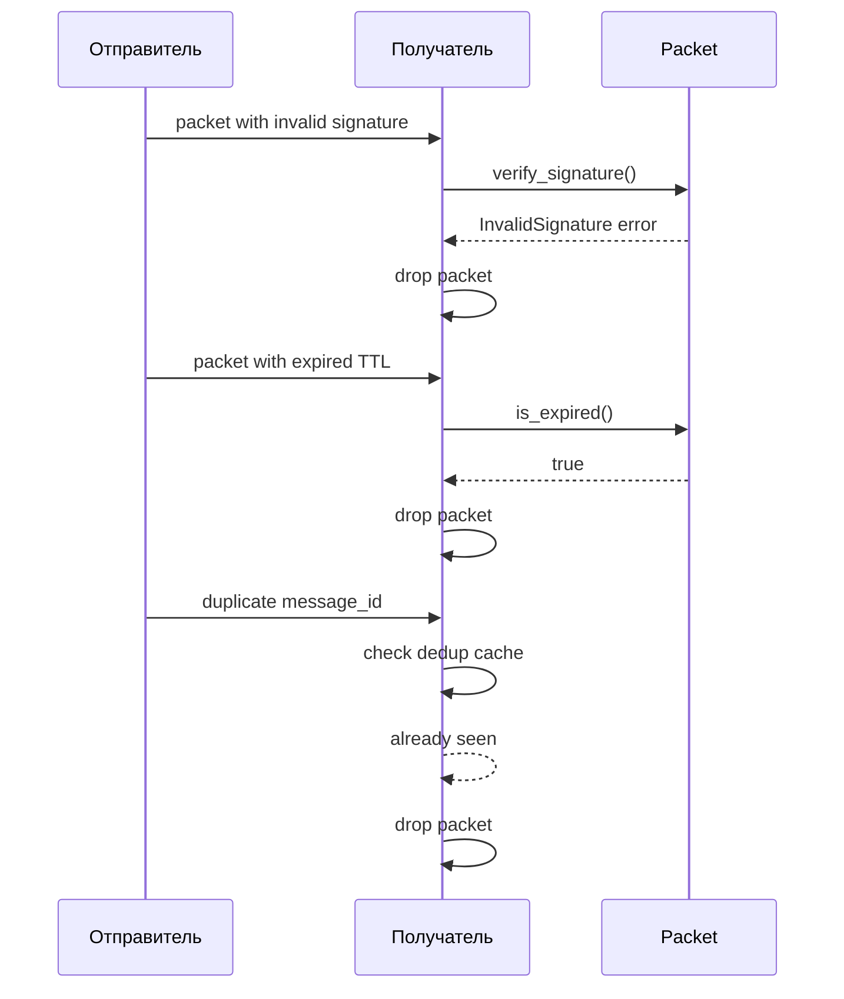

# Sequence Diagram: Передача пакета в «Я ОК»

## Основной flow: Отправка статуса



## Расширенный flow: Получение и forwarding



## Flow: Gossip синхронизация



## Flow: Адаптивный выбор транспорта



## Flow: Policy enforcement



## Data Flow: Структура пакета

```
Packet {
  message_id: "uuid"
  sender_id: "hex_public_key"
  timestamp: "2024-01-20T10:30:00Z"
  ttl: 3600
  hops: 0
  max_hops: 10
  priority: High
  encrypted_payload: {
    ciphertext: "aes_gcm_encrypted_data"
    nonce: "12_bytes"
    sender_public_key: "32_bytes_x25519"
  }
  signature: "64_bytes_ed25519"
}
```

## Error Handling Flow



## Performance Considerations

### Fast Path (BLE, локальная сеть)
- Direct packet forwarding
- Minimal encryption overhead
- No storage for transit packets

### Slow Path (Store & Forward)
- Persistent storage
- TTL management
- Background forwarding when transport available

### Gossip Path (синхронизация)
- Digest-based exchange
- Only missing messages
- Background periodic sync